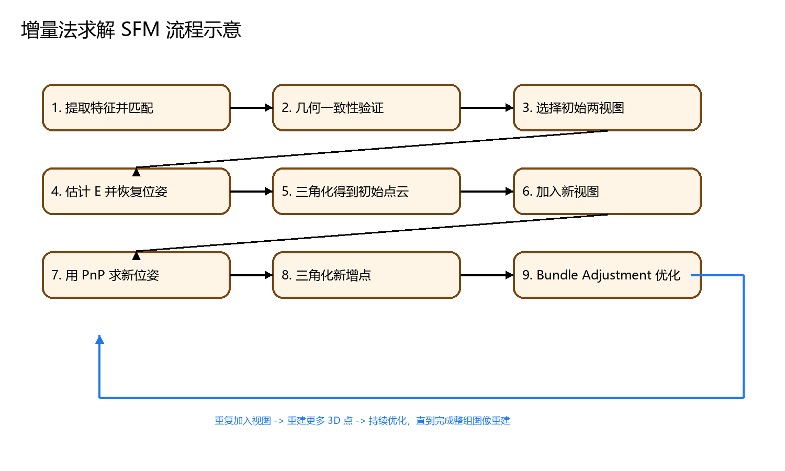

# 计算机视觉期末复习整理（小白展开讲解版）

说明：

1. 这份是给“几乎没上过课、很多概念第一次见”的人写的。
2. 我只围绕 `emphasis/课堂划重点.txt` 里提到的东西展开，不额外扩展很多课外内容。
3. 每个知识点我尽量按这 4 层来讲：
   - 它到底是什么
   - 为什么会有这个东西
   - 它和别的概念怎么区分
   - 如果考试问到，你应该怎么答

---

## 先建立一条总主线：这门课到底在干什么

如果你把这门课所有内容都揉成一句话，可以这样理解：

**计算机视觉就是让机器“像人一样看”，但不是单纯看到图像，而是要从图像里恢复信息、理解内容，甚至恢复三维结构。**

所以这门课大致分成 3 层：

1. **人眼和视觉基础**
   这部分回答：人是怎么“看见”的？什么叫看清？什么叫看不清？为什么会有错觉？

2. **相机和成像系统**
   这部分回答：机器是怎么“拍到”的？镜头、CCD、焦距、光圈这些到底在干什么？

3. **从图像恢复三维或理解场景**
   这部分回答：两张图怎么知道是同一个点？怎么恢复三维？怎么从多张图恢复整个场景？

你可以把后面的知识点都往这条主线上挂：

- 人眼章节：解释“什么是看”
- 光学和相机章节：解释“机器怎么拍”
- 三角化 / 双目 / SFM / RANSAC 章节：解释“拍完以后怎么算”

---

## 一、三大会议名称：为什么老师会讲这个

### 1. 它们是什么

- `CVPR` = `Conference on Computer Vision and Pattern Recognition`
- `ICCV` = `International Conference on Computer Vision`
- `ECCV` = `European Conference on Computer Vision`

中文分别是：

- 计算机视觉与模式识别会议
- 国际计算机视觉会议
- 欧洲计算机视觉会议

### 2. 为什么课上会讲这个

因为这三个会就是**计算机视觉领域最顶级的学术会议**。老师讲它们，不是为了让你研究学术八卦，而是告诉你：

- 这门课不是孤立的
- 这些方法背后有一个完整的学科体系
- 以后你看到论文、竞赛、算法，很多都来自这些会

### 3. 对小白最重要的理解

你不用把它们想得太神秘。考试里它们更像：

- 术语翻译题
- 填空题
- “哪个是视觉顶会”的识别题

### 4. 考试怎么答

如果问“CVPR 是什么”，最稳的答法就是：

`CVPR 是 Conference on Computer Vision and Pattern Recognition 的缩写，中文是计算机视觉与模式识别会议，是计算机视觉领域的重要顶级会议之一。`

### 5. PPT 原图

**PPT 原图标注：三大会议总览，来自《计算机视觉-1计算机视觉应用概述》约 p.24**

**PPT 原图标注：课内习题风格页，考三大会议识别，来自《计算机视觉-1计算机视觉应用概述》约 p.26（课内习题）**

---

## 二、摄影测量、图像处理、图像分析、图像理解：它们不是一回事

### 1. 摄影测量（photogrammetry）到底是什么

你可以把“摄影测量”理解成一句很朴素的话：

**不是为了把东西拍好看，而是为了从照片里“量出东西”。**

比如：

- 这个建筑有多高
- 这块地是什么形状
- 这个场景的三维结构是什么

所以摄影测量和普通拍照的区别在于：

- 普通拍照：关注“看起来好不好”
- 摄影测量：关注“能不能算出几何信息”

### 2. 为什么它和无人机有关系

因为无人机可以从多个角度拍摄同一个场景。

一旦你从多个角度拍同一个东西，就有机会：

- 找到同一个点在不同图里的位置
- 根据这些位置去恢复三维结构

这就是测绘、建模、地形恢复的基础。

### 3. 图像处理、图像分析、图像理解怎么区分

这三个词看上去都像“对图像做事”，但层次不一样。

#### 图像处理

图像处理最像“修图”和“预处理”。

比如：

- 去噪
- 增强
- 滤波
- 提高对比度

核心特征：

**输入是图像，输出还是图像。**

#### 图像分析

图像分析不再只想“让图更清楚”，而是开始从图里提信息。

比如：

- 找边缘
- 找角点
- 找纹理
- 找目标区域

核心特征：

**输入是图像，输出是某种结构化信息。**

#### 图像理解

图像理解再往上一层，它不满足于“知道边缘在哪”，它想知道：

- 这是什么东西
- 这个人在干什么
- 这个场景意味着什么

核心特征：

**输入是图像，输出是语义。**

### 4. 考试怎么答最稳

如果考试问区别，你就答：

`图像处理主要是改善图像质量，输入和输出通常都是图像；图像分析主要是从图像中提取特征或几何信息；图像理解则进一步对图像内容进行语义层面的解释，如识别目标类别、行为和场景含义。`

### 5. PPT 原图

**PPT 原图标注：无人机近景摄影测量，来自《计算机视觉-1计算机视觉应用概述》约 p.74**

---

## 三、人眼视觉：先弄懂“什么叫看清”

这一块是很多小白最容易乱掉的地方，因为老师一会儿说人眼参数，一会儿说视力表，一会儿说错觉，一会儿说注意力。

其实你把它拆开就清楚了。

这一章本质上在回答 4 个问题：

1. 人眼这个“系统”长什么样
2. 什么叫看清
3. 为什么会看错
4. 为什么“看见了”不等于“注意到了”

### 1. 人眼参数到底在记什么

老师提“人眼参数”，不是让你学医，而是要你知道：

**人眼本身也是一个成像系统。**

它有点像一台天然相机：

- 角膜、晶状体：像镜头
- 瞳孔：像光圈
- 视网膜：像成像面 / 传感器

所以很多相机概念，你其实可以先拿人眼来理解。

#### 角膜和晶状体

它们负责折射光线，让外界物体最终成像到视网膜上。

#### 瞳孔

瞳孔最重要的作用是控制进入眼睛的光量。

所以：

- 光强时瞳孔缩小
- 光弱时瞳孔放大

这和相机“光圈大小影响进光量”是一回事。

#### 视网膜

视网膜是最终接收图像信息的地方。

如果把眼睛比作相机，视网膜就相当于：

- 胶片
- 或者传感器

#### 黄斑和中央凹

老师反复提它们，是因为它们和“看得最清楚的区域”有关。

其中：

- 黄斑：视网膜上的关键精细视觉区域
- 中央凹：黄斑中心，视力最敏锐

你可以简单记成：

**中央凹 = 人眼最会看细节的地方**

#### 视神经盘

这里没有感光细胞，所以对应“生理盲点”。

这也是为什么人眼并不是一个完美无缺的探测器。

### 2. 什么叫空间分辨率

“空间分辨率”这个词你第一次看会觉得很吓人，其实它问的只是：

**两个很靠近的点，你还能不能把它们看成两个点？**

如果能，就说明你的分辨能力够。
如果看成一个点，就说明分辨能力不够。

所以它的本质是：

**分辨细节的能力。**

### 3. 正常视力标准为什么是 1' 和 5.0

这里很多人容易背混。

你要这样理解：

- `1'` 是“最小分辨视角”
- `5.0` 是“正常视力的记法”

也就是说，课件定义：

**能分辨 1 角分（1'）视角的视力，记为 5.0。**

这就是为什么老师总把这两个一起讲。

### 4. E 视标为什么总出现

因为它是把“能否分辨细节”标准化的一种方法。

课件里说得很清楚：

- E 字每一笔画或空隙宽度，是整体边长的 `1/5`

这意味着：

- 如果你能分辨这些小笔画和缝隙
- 就说明你能分辨某个最小细节尺度

所以 E 视标不是“一个随便的字母”，它本质上是一个**标准化分辨率测试图形**。

### 5. 瑞利判据为什么会扯进来

因为它告诉你：

**两个点到底在什么情况下才算“刚好分得开”。**

也就是说：

- 空间分辨率：偏现象和能力
- 瑞利判据：偏理论和标准

二者关系是：

瑞利判据给出了“刚好分辨”的判断规则，而空间分辨率是在说系统实际有多会分辨。

### 6. 视觉残留是什么

视觉残留可以理解成：

**图像消失后，视觉印象不会立刻完全清零，而会短暂保留。**

这件事为什么重要？

因为很多动态视觉效果，比如动画、视频连续感，和它有关系。

### 7. 视错觉为什么会发生

视错觉不是“你眼睛坏了”，而是：

**你的视觉系统在做解释时，被背景、对比、参照或经验带偏了。**

换句话说，人眼并不是照相机那样“原样复制现实”，它会加工、会判断、会补偿。

所以才会出现：

- 长短错觉
- 明暗错觉
- 栅格错觉
- 大小错觉

### 8. “看不见的大猩猩”到底想说明什么

这不是在考搞笑实验，而是在考：

**注意力机制。**

它想说明：

**看见，不等于注意到。**

当你把注意力全部放在“数球传几次”这种任务上时，大脑会主动忽略旁边的明显信息。

这叫：

- 选择性注意
- 注意盲视

### 9. 这一章考试怎么答

如果是简答题，最稳的思路是：

1. 先给定义
2. 再解释成白话
3. 最后说它在视觉系统中的意义

比如问“什么是空间分辨率”，你不要只写一句“分辨两个点的最小夹角”，最好再补一句：

`它反映了人眼或成像系统分辨细节的能力，是评价视觉清晰度的重要指标。`

### 10. PPT 原图

**PPT 原图标注 1：E 视标与正常视力标准，来自《2.3 人眼视觉特性》约 p.10**

**PPT 原图标注 2：正常视力单选题风格页，来自《2.3 人眼视觉特性》约 p.20（课内习题）**

**PPT 原图标注 3：典型视错觉示例，来自《2.3 人眼视觉特性》约 p.30**

**PPT 原图标注 4：看不见的大猩猩与注意盲视，来自《2.3 人眼视觉特性》约 p.50**

---

## 四、动态范围和 HDR：为什么肉眼能看清，相机却拍不好

### 1. 动态范围是什么

动态范围这个词的本质意思是：

**一个系统能同时处理多大亮度跨度。**

如果一个场景里：

- 最亮的地方特别亮
- 最暗的地方特别暗

那么系统要同时保住明暗细节，就需要大的动态范围。

### 2. 为什么相机容易出问题

因为普通相机的动态范围通常不如人眼。

结果就是：

- 亮的地方容易全白
- 暗的地方容易全黑

人眼看着正常，照片却“死黑死白”，就是这个原因。

### 3. HDR 是干什么的

`HDR = High Dynamic Range`

就是：

**让系统能表示更大的亮度范围。**

你可以把 HDR 理解成“更会同时照顾亮部和暗部”。

### 4. 考试怎么答

如果问“HDR 为什么有效”，最稳的答法：

`HDR 通过扩大成像系统可表示的亮度范围，使高亮区域不过曝、暗部区域不过暗，从而保留更多细节。`

### 5. PPT 原图

**PPT 原图标注：HDR 与 SDR 对比，来自《2.3 人眼视觉特性》约 p.63**

---

## 五、光度学：为什么会有光通量、辐通量、照度这些看着很烦的词

这一块最容易懵，是因为你会觉得：

- 都和光有关
- 都像“亮不亮”
- 怎么还分这么多词

其实它们是在回答不同层面的问题。

### 1. 辐通量：从物理上看有多少光能

辐通量更偏物理。

它在问：

**这个光源总共发了多少辐射功率？**

所以它的单位常见是：

- `W`

### 2. 光通量：从“人看起来”有多少光

光通量和辐通量的区别就在于：

**光通量把人眼敏感性考虑进去了。**

因为同样功率的不同波长光，人眼感觉到的亮度不一样。

所以：

- 辐通量：物理上的光能
- 光通量：视觉上的“亮度贡献”

### 3. 为什么要有光谱光效率函数

因为人眼不是对所有波长都一样敏感。

人眼对白天视觉最敏感的大约在：

- `555 nm`

光谱光效率函数 `V(λ)` 就是在描述：

**不同波长对人眼来说“看起来有多亮”。**

### 4. 照度是什么

照度是在问：

**单位面积上接收到了多少光通量。**

所以它不是“总共多少光”，而是“摊到面积上有多少光”。

单位是：

- `lx`

### 5. 颜色匹配实验为什么重要

这部分是色度学的基础。

它想说明：

**不同颜色的光，可以通过三原色按比例混合得到相同的视觉效果。**

也就是说，颜色并不是“只有一种唯一物理表达”，而是和人眼感知有关。

这就是为什么后面会有：

- 三刺激值
- RGB 色度系统

### 6. 光源为什么会影响成像

因为“拍出来什么样”不仅由相机决定，还由光怎么照决定。

主要影响因素包括：

- 光强
- 波长 / 光谱
- 入射方向
- 是否扩散
- 是否偏振

比如：

- 表面反光很强时，扩散光可能更适合
- 想消除高光时，偏振光可能更有帮助

### 7. 考试怎么答

如果问“光通量和辐通量的区别”，你最稳的答法就是：

`辐通量描述光辐射的物理能量大小，而光通量是在辐通量基础上考虑人眼视觉敏感性后得到的视觉相关量。`

### 8. PPT 原图

**PPT 原图标注 1：光谱光效率函数，来自《2.4 光度学与色度学》约 p.5**

**PPT 原图标注 2：光通量单位单选题，来自《2.4 光度学与色度学》约 p.30（课内习题）**

**PPT 原图标注 3：颜色匹配 / 三刺激值，来自《2.4 光度学与色度学》约 p.45**

---

## 六、镜头、F 数、光圈、CCD：先把相机看成一套“机器眼睛”

这一章如果不建立类比，会很容易乱。

最简单的记法：

- 镜头 ≈ 眼睛里的折射系统
- 光圈 ≈ 瞳孔
- CCD / CMOS ≈ 视网膜 / 感光面

### 1. 镜头在做什么

镜头最核心的事就是：

**把来自物体的光线按几何规律聚到成像面上。**

如果没有镜头，光乱进来，图像就没法清晰成像。

### 2. 焦距到底是什么

焦距是镜头非常核心的参数。

你可以先记住它和两个现象关系最紧：

1. 成像放大程度
2. 视场范围

通常来说：

- 焦距长：看得更“近”，视场更小
- 焦距短：看得更“广”，视场更大

### 3. F 数到底是什么

课件里定义：

`F 数 = 焦距 / 有效孔径`

你不要把它只当公式背，真正要理解的是它控制了：

- 进光量
- 景深

一般规律：

- F 数小：孔相对大，进光多
- F 数大：孔相对小，进光少

### 4. 光圈档位为什么重要

因为光圈就是调进光量的。

你可以把它想成“相机睁眼睁多大”。

开大一点：

- 光多
- 更亮

收小一点：

- 光少
- 更暗

### 5. 远心镜头为什么适合测量

普通镜头会有透视效果：

- 近的大
- 远的小

这对“看起来真实”有用，但对“量尺寸”不友好。

远心镜头的价值就在于：

**尽量减小这种透视变化，让尺寸更稳定。**

所以工业测量很喜欢它。

### 6. CCD 到底是什么

`CCD = Charge Coupled Device`

中文是：

- 电荷耦合器件

它的核心思想是：

1. 光照到感光单元
2. 产生与光强相关的电荷
3. 再把这些电荷读出来，变成图像信号

也就是说，CCD 本质上是“把光变成电信号”的器件。

### 7. 彩色 CCD 为什么要靠滤色片

因为感光单元本身主要知道“有多少光”，并不天然知道“这是什么颜色的光”。

所以必须在前面加滤色片，把不同颜色分开。

常见思路是：

- 红
- 绿
- 蓝

很多阵列里绿色会更多，因为人眼对亮度和绿色变化更敏感。

### 8. 1 英寸为什么会被提到

这是工业相机和传感器规格里的常见写法。

最基础的常识是：

- `1 inch = 25.4 mm`

但你要知道，传感器里的“1 英寸靶面”是历史命名，不一定等于真实几何尺寸完全就是 25.4 mm 对角线。

考试如果没特别深究，记住 25.4 mm 这层最稳。

### 9. 考试怎么答

如果问“彩色 CCD 原理”，你不要只写“有滤色片”，最好写完整一点：

`彩色 CCD 通过在感光单元前加滤色片对不同颜色光进行分离，使各感光单元分别记录不同波段的光强，再经过插值或重建得到彩色图像。`

### 10. PPT 原图

**PPT 原图标注 1：CCD 基本定义，来自《视觉系统构成》约 p.64**

**PPT 原图标注 2：彩色 CCD / MOS 结构示意，来自《视觉系统构成》约 p.90**

---

## 七、几何变换、坐标系、标定：为什么相机不是拍完就算完

这一块本质在回答一个问题：

**现实世界里的点，怎么变成图上的像素点？**

### 1. 为什么要有这么多坐标系

因为一个点在不同阶段，“描述方式”不一样。

#### 世界坐标系

这是现实世界里的统一参考系。

比如：

- 这个点在桌子上方 10 cm
- 在相机左边 20 cm

这些都更像世界中的位置。

#### 相机坐标系

这是“以相机自己为参考”的坐标。

它回答：

**这个点相对于相机在什么位置？**

#### 图像坐标系

这是点投影到成像平面后的连续坐标。

#### 像素坐标系

这是最终数字图像里真正用的格点坐标。

### 2. 为什么要做坐标变换

因为相机最终只看到二维像素，但现实世界是三维的。

所以必须经历：

世界坐标 -> 相机坐标 -> 图像坐标 -> 像素坐标

这就是整套投影过程。

### 3. 几何变换为什么要用矩阵

因为：

- 平移
- 旋转
- 缩放
- 投影

这些本来都是规则操作。

一旦写成矩阵，就有两个巨大好处：

1. 公式统一
2. 多个变换可以直接连乘

这就是为什么计算机视觉里这么爱写矩阵。

### 4. 相机内参数是什么

相机内参数不是“相机摆在哪里”，而是：

**相机内部成像方式的参数。**

比如：

- 焦距相关量
- 主点位置
- 像素尺度
- 坐标轴斜切

你可以理解成：

**同一台相机，换地方拍，内参不一定变；但镜头结构、成像几何决定了内参。**

### 5. 相机标定是什么

相机标定的目的就是：

**把这台相机的内外参数搞清楚。**

这样后面你才能：

- 恢复几何关系
- 做三维计算
- 做精确测量

### 6. 标定板为什么重要

因为你总得有一个“已知真值”的参考物。

标定板提供了：

- 已知的几何点
- 稳定的结构

这样你才可以把“图像里的点”对应回“真实世界里的点”。

### 7. 考试怎么答

如果问“标定板作用”，你最稳的答法：

`标定板提供已知几何结构和稳定特征点，使图像点与真实空间点建立对应关系，从而用于求取相机的内参数、外参数以及畸变参数。`

### 8. 原课件对应位置

- 《计算机视觉-4 光学成像原理&相机标定》约 `p.60`：内参数矩阵形式
- 《计算机视觉-4 光学成像原理&相机标定》约 `p.80~90`：相机标定章节开始
- 《计算机视觉-4 光学成像原理&相机标定》约 `p.90`：标定目标与已知点

**PPT 原图标注：相机内参与投影模型，来自《光学成像原理&相机标定》约 p.60**

**PPT 原图标注：相机标定章节页，来自《光学成像原理&相机标定》约 p.80**

**PPT 原图标注：相机标定目标，来自《光学成像原理&相机标定》约 p.90**

---

## 八、理想光学系统和作图题：你到底要画什么

这一块是典型“理解不到位就不会画”的内容。

### 1. 理想光学系统到底在抽象什么

它是在把真实复杂镜头系统做简化。

这样你就不用画很多镜片，只需要抓住最关键的几何关系。

### 2. 为什么课件总画 H、H'、F、F'

因为这些点和面是这个简化系统里最关键的参照物。

- `H`、`H'`：主面
- `F`、`F'`：焦点

你可以把它们看成：

**描述光线如何进入、如何离开系统的关键“坐标标记”。**

### 3. 平行于光轴的光线为什么要过 F'

这是理想光学系统最重要的成像规律之一。

意思是：

- 入射前和光轴平行
- 经过系统后汇聚到像方焦点 `F'`

考试作图题经常就抓这一条。

### 4. 你作图时最容易错在哪

最常见错误是：

- 只画了一条线，没标点
- 标了 F 没标 F'
- 只知道“过焦点”，但没交代它为什么这样走

所以画图时一定要同时画：

- 光轴
- 主面
- 焦点
- 入射线
- 出射线

### 5. 焦距选择为什么会变成计算题

因为工业视觉不是“拍着玩”，而是：

**你要先知道要看多大范围、目标多大、相机离目标多远，再反推应该用什么镜头。**

也就是说，焦距选择题本质是在考：

- 成像比例
- 视场
- 工作距离

### 6. 自绘辅助图

### 7. PPT 原图

**PPT 原图标注 1：理想光学系统示意，来自《光学成像原理&相机标定》约 p.40**

**PPT 原图标注 2：理想光学系统作图题，来自《光学成像原理&相机标定》约 p.50（课内习题）**

---

## 九、三角化和极几何：为什么两张图能恢复三维

这是很多人最怕的一块，但其实主线很清楚。

### 1. 三角化到底想干什么

三角化想做的事非常直接：

**已知同一个空间点在两张图里分别落在哪，反推出它在三维空间中的位置。**

为什么这有可能？

因为同一个点从两个不同相机看过去，会产生两条“视线”。

理想情况下：

- 这两条视线会交于真正的三维点

这就是“三角化”这个名字的来源。

### 2. 为什么会有噪声问题

现实里点的位置不可能测得完全准，所以两条视线往往：

- 不完全相交

这时候你就不能直接说“交点就是答案”，而要找一个“最合理”的三维点。

### 3. 极几何到底在干什么

极几何不是在直接求三维点，而是在解决一个更基础的问题：

**左图这个点，右图到底该去哪里找对应点？**

如果你不先解决“谁和谁对应”，三角化根本没法做。

### 4. 极平面、极线、极点怎么理解

这三个词第一次看很抽象，其实可以按“平面 -> 线 -> 点”来理解。

#### 极平面

由：

- 空间点 `P`
- 左相机中心
- 右相机中心

三者共同决定一个平面，这就是极平面。

#### 极线

极平面和某个图像平面的交线，就是极线。

意思是：

如果左图某点是真对应点，那么右图对应点一定落在某条极线上。

#### 极点

两个相机中心连线叫基线。

基线和图像平面的交点就是极点。

### 5. 本质矩阵 E、基础矩阵 F、单应矩阵 H 到底怎么分

这是高频混淆点。

#### 本质矩阵 E

它描述的是：

**规范化相机坐标下的两视图极几何关系。**

你可以简单理解成：更“纯粹几何”的版本。

#### 基础矩阵 F

它描述的是：

**像素坐标下的两视图极几何关系。**

所以它更贴近“真实图像上的对应点约束”。

#### 单应矩阵 H

它不是专门给一般三维点准备的，而更常用在：

**同一平面上的点，在两张图之间怎么变换。**

### 6. 为什么 F 的秩是 2 会被拿出来考

因为这说明它不是随便一个 3x3 矩阵，而是有特殊几何结构的。

老师爱考这个点，是因为：

- 它能体现你不只是背名字
- 还知道基础矩阵有结构约束

### 7. 自绘辅助图

### 8. PPT 原图

**PPT 原图标注 1：基础矩阵定义页，来自《三角化与极几何》约 p.30**

**PPT 原图标注 2：基础矩阵秩约束 / 估计，来自《三角化与极几何》约 p.35**

---

## 十、双目立体视觉：为什么“平行”这么重要

### 1. 双目立体视觉的核心任务

双目立体视觉的目标是：

**利用左右两幅图之间的差异，恢复深度。**

### 2. 为什么平行视图更好处理

如果两台相机是平行布置的，理想情况下对应点会落在同一条扫描线上。

这意味着：

- 原来你可能要在二维区域里找
- 现在只要沿一条线找

所以问题大大简化。

### 3. 图像校正是在干嘛

现实里相机不一定天然完全平行。

图像校正就是：

**通过变换让两幅图在几何上尽量变得像“平行视图”。**

这样后面做对应点搜索更方便。

### 4. 视差是什么

同一个点在左右图里的水平位置不一样，这个差就叫视差。

最重要的直觉是：

- 视差大 -> 通常更近
- 视差小 -> 通常更远

### 5. 相关法是什么

相关法是最经典的匹配方法之一。

它的想法非常朴素：

1. 左图取一个小窗口
2. 去右图同一扫描线附近滑动寻找
3. 看哪里最像
4. 最像的地方就当对应点

### 6. 相关法为什么有问题

因为“像不像”这件事有时不可靠。

比如：

- 一大片纯色区域，到处都差不多
- 重复纹理，多个地方都很像
- 一边看见一边被遮挡
- 光照变化导致亮度不一样

这就是课件里“相关法存在的问题”。

### 7. PPT 原图

**PPT 原图标注 1：图像校正 / 立体校正，来自《双目立体视觉》约 p.30**

**PPT 原图标注 2：相关法与窗口影响，来自《双目立体视觉》约 p.40**

---

## 十一、SFM：为什么多张图能恢复整个场景

这一章是整门课最像“大题主线”的部分。

### 1. SFM 到底是什么

`SFM = Structure from Motion`

中文一般说：

- 运动恢复结构

它的目标不是只恢复一个点，而是：

**从多张图像中，恢复整个场景的三维结构，同时恢复每张图对应相机的位置和姿态。**

### 2. 为什么它叫“Structure from Motion”

因为相机在变位置，或者场景视角在变化。

正是这种“运动带来的不同视图”，让你有机会恢复结构。

所以它不是“静止不动从一张图看透世界”，而是：

**靠多视角变化，反推三维结构。**

### 3. 增量法为什么重要

因为增量法最符合人类直觉，也最常见：

- 先拿两张图做起点
- 先恢复一个粗糙的初始结构
- 然后不断加入新图
- 让结构越来越完整

这就像搭积木。

### 4. 增量法的每一步到底在干嘛

#### 第一步：特征提取与匹配

先找图中稳定、可重复找到的点，再判断哪些点在不同图里是同一个真实点。

#### 第二步：几何一致性验证

匹配不可能全对，所以要先剔除明显错的对应点。

#### 第三步：选初始两视图

先从一对比较合适的图开始，因为没有初始结构，后面根本没法扩展。

#### 第四步：估计 E 并恢复位姿

先搞清楚两台相机的相对关系。

#### 第五步：三角化初始点云

利用两图对应点恢复第一批三维点。

#### 第六步：加入新视图

让第三张、第四张图不断进来。

#### 第七步：PnP

已知一些三维点和它们在新图中的二维投影，反过来求这张新图对应相机的位置和姿态。

#### 第八步：三角化新增点

在已有相机位姿基础上，恢复更多三维点。

#### 第九步：Bundle Adjustment

前面每一步都会有误差，BA 就是把：

- 相机参数
- 三维点

一起重新优化，让整体更准。

### 5. 为什么 PnP 和 BA 总是和 SFM 绑在一起

因为：

- `PnP` 解决“新相机在哪”
- `BA` 解决“整体怎么更准”

这两个是增量 SFM 能不能稳定跑下去的关键。

### 6. 自绘辅助图

### 7. PPT 原图

**PPT 原图标注：增量法求解 SFM 流程页，来自《运动恢复结构》约 p.44**

---

## 十二、RANSAC 和霍夫变换：为什么不是所有点都可信

### 1. 为什么要有 RANSAC

现实数据里经常会有错点、离群点、误匹配点。

如果你傻乎乎把所有点都拿去算一条线或一个矩阵，结果就会被坏点严重带偏。

所以需要一种方法：

**哪怕有很多坏点，也尽量找到由“多数好点支持”的模型。**

这就是 RANSAC 的核心思想。

### 2. RANSAC 的流程为什么有效

它赌的是：

**多试几次，总有机会抽到一组主要由内点组成的样本。**

一旦抽到了比较干净的样本，就能拟合出一个比较像样的模型；
然后再看全体数据里有多少点支持它。

谁支持者最多，谁就更可能是对的。

### 3. 内点和外点怎么理解

- 内点：符合真实模型的点
- 外点：错误点、噪声点、误匹配点

RANSAC 本质就是在做“谁是自己人”的筛选。

### 4. 霍夫变换为什么和 RANSAC 不一样

霍夫变换不是随机抽样，而是：

**让每个点去参数空间投票。**

如果很多点都支持某条线，那条线对应的参数位置票数就高。

所以霍夫变换更像：

- 集体投票找峰值

而 RANSAC 更像：

- 多次试验找最被多数支持的假设

### 5. 累加器单元算法到底是什么

就是把参数空间切成很多小格子。

每个格子相当于一个“候选参数单元”。

图像中的每个特征点会给它可能对应的格子投票。

最后哪格票多，哪格就最可能对应真实目标。

### 6. 自绘辅助图

### 7. PPT 原图

**PPT 原图标注 1：RANSAC 概述页，来自《拟合》约 p.20**

**PPT 原图标注 2：霍夫变换参数空间示意，来自《拟合》约 p.45**

---

## 十三、中英翻译小专题（更适合直接背）

下面这组术语是我判断最像出中英互译题的内容。

- `CVPR` = `Conference on Computer Vision and Pattern Recognition` = `计算机视觉与模式识别会议`
- `ICCV` = `International Conference on Computer Vision` = `国际计算机视觉会议`
- `ECCV` = `European Conference on Computer Vision` = `欧洲计算机视觉会议`
- `photogrammetry` = `摄影测量`
- `Visual illusion` = `视错觉`
- `Structure from Motion` = `运动恢复结构`
- `Random Sample Consensus` = `随机采样一致性`
- `Hough Transform` = `霍夫变换`
- `Essential Matrix` = `本质矩阵`
- `Fundamental Matrix` = `基础矩阵`
- `Homography` = `单应`
- `Bundle Adjustment` = `捆绑调整`
- `PnP` = `Perspective-n-Point`
- `HDR` = `High Dynamic Range`
- `CCD` = `Charge Coupled Device`
- `CMOS` = `Complementary Metal-Oxide-Semiconductor`
- `Field of View` = `视场`
- `Working Distance` = `工作距离`
- `F-number` = `F 数`
- `Rayleigh criterion` = `瑞利判据`

---

## 十四、最后给小白的复习建议

如果你现在时间紧，而且确实是从零开始，我建议别试图“全都一样用力”，而是按这条顺序来：

### 第一层：先背最像会考的大主线

1. `SFM`
2. `增量法`
3. `RANSAC`
4. `三角化`
5. `基础矩阵 / 本质矩阵 / 单应矩阵`

### 第二层：再背最像填空和翻译的点

1. `CVPR / ICCV / ECCV`
2. `photogrammetry`
3. `visual illusion`
4. `HDR`
5. `CCD`
6. `Rayleigh criterion`

### 第三层：最后补“人眼 + 光学 + 相机”

1. 正常视力 `1' -> 5.0`
2. E 视标
3. 光通量 / 辐通量 / 照度
4. F 数 / 光圈 / 焦距
5. 相机标定 / 标定板

### 最后一句

这门课不是在背一堆散词，而是在讲一件完整的事：

**人怎么能看清 -> 机器怎么能拍清 -> 拍完以后怎么从图像里算出结构和信息。**
