# 计算机视觉期末逐条划重点详解版

这份文档按 `课堂划重点.txt` 的顺序整理，只围绕你提到的重点展开。每个知识点尽量给出：课件原话或定义、原 PPT 图、课内题目、小白解释、考试答法。  

我判断老师最可能重点考的内容会讲得更深：`增量法 SFM`、`RANSAC / 霍夫变换`、`三角化与极几何`、`E/F/H`、`人眼空间分辨率与 1′`、`光通量/辐通量/照度`、`相机标定`、`理想光学系统作图`、`焦距/双目/动态范围计算`。

## 0. 卷面信号和优先级

你记录的试卷构成是：填空 30 分、八个术语翻译中英互译、简答 40 分、画图 5 分、计算 5 分、综合题 20 分。这个结构说明：不能只背定义，还要能写流程、会画图、会代公式。

### 最该优先背的 8 块

| 优先级 | 重点 | 为什么像重点 | 必须掌握到什么程度 |
|---|---|---|---|
| S | 增量法 SFM | 你写“貌似必考”，课件有完整流程页 | 能写输入、输出、Tracks、连通图、E、三角化、PnP、BA |
| S | RANSAC + 霍夫变换 | 拟合章节核心，课件有“外点/很多直线怎么办” | 能比较最小二乘、RANSAC、Hough，并写流程 |
| S | 三角化、极几何、E/F/H | 三维视觉主线，定义、公式、秩约束都能出题 | 能画图、会区分 E/F/H、知道 F 秩为 2 |
| A | 人眼空间分辨率、1′、瑞利判据 | 填空、单选、计算都出现 | 会解释 1′、5.0、Retina、最小可分辨角 |
| A | 光通量、辐通量、照度、555nm | 课件有连续单选和定义 | 单位、定义、区别必须准确 |
| A | 相机标定、内外参、标定板 | 简答概率高 | 能说清 K、R/t、标定板作用和标定目标 |
| A | 理想光学系统作图 | 你记录“貌似画图题”，课件确有主观题 | 会画 H/H'、F/F'、光轴和出射线 |
| A | 焦距选择、双目深度、动态范围 | 计算题候选 | 会公式、代数、单位 |

---

## 1. 三大会议名称：CVPR、ICCV、ECCV

### 课件原话 / 定义

课件《计算机视觉-1计算机视觉应用概述》p.24 写了：`IEEE/CVF 计算机视觉与模式识别会议（CVPR）`、`国际计算机视觉会议（ICCV）`、`ECCV（欧洲计算机视觉会议）`，并标为 `计算机视觉三大顶级会议`。

### 原 PPT


### 课内题目

课件 p.26 有单选题：`下列哪项是计算机视觉三大顶级会议之一，且每两年举办一次（偶数年举行）？` 答案是 `ECCV`。

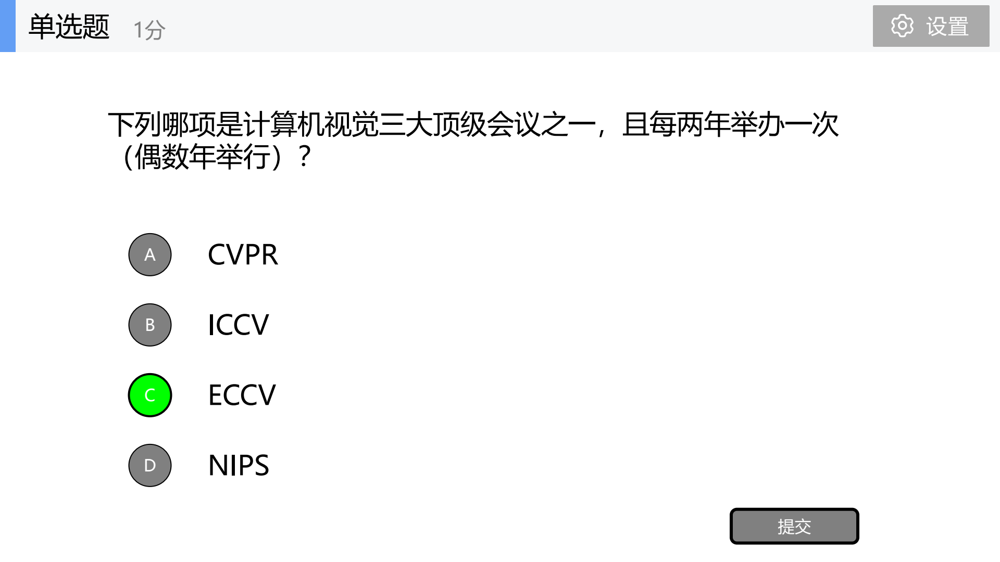

### 小白解释

这三个不是算法，而是计算机视觉领域最重要的会议名。考试大概率考缩写、英文全称、中文含义、是否属于视觉顶会。

### 考试答法

`CVPR = Conference on Computer Vision and Pattern Recognition，计算机视觉与模式识别会议；ICCV = International Conference on Computer Vision，国际计算机视觉会议；ECCV = European Conference on Computer Vision，欧洲计算机视觉会议。三者是计算机视觉三大顶级会议。`

---

## 2. 摄影测量 photogrammetry 和产业应用

### 课件原话 / 定义

课件《计算机视觉-1计算机视觉应用概述》p.74 提到 `贴近摄影测量(nap-of-the-object photogrammetry)`，利用倾斜摄影影像处理出的粗略模型，进行空中三角测量得到目标的高程和 `3D 点云`。

### 原 PPT

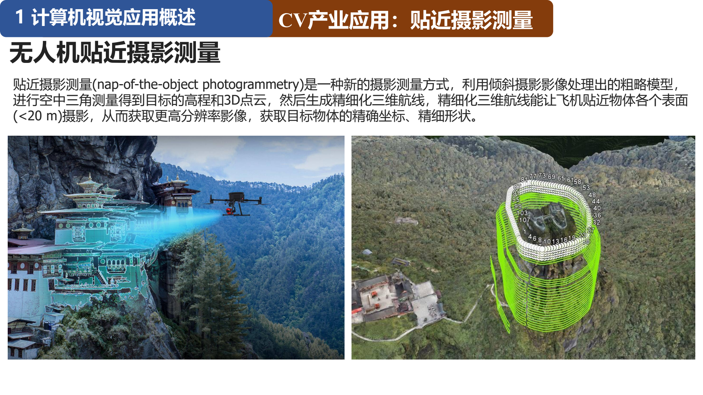

### 课内题目

课件 p.9 有开放题：`您能列举 3 个计算机视觉的典型应用案例吗？` p.107 和 p.110 又出现产业应用、低空经济应用题。

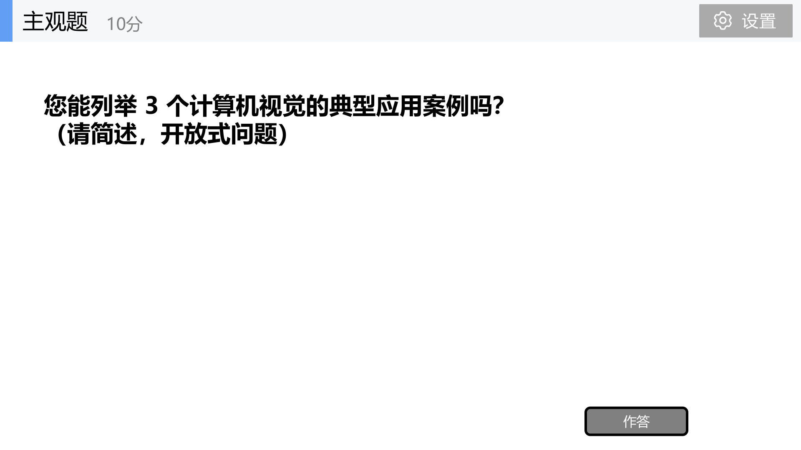

### 小白解释

摄影测量不是“摄影好不好看”，而是“从照片里量东西”。无人机绕着建筑、地形、桥梁拍很多照片，然后通过多视角几何算出高程、形状、点云。

### 考试答法

`Photogrammetry 是摄影测量，指利用图像恢复目标的位置、尺寸、形状、高程或三维结构等几何信息。无人机测绘是典型应用，因为无人机能从多个视角采集图像，再通过空中三角测量和三维重建得到点云或模型。`

---

## 3. 图像处理、图像分析、图像理解

### 小白解释

这三个概念的区别是层次越来越高：

| 名词 | 输入 | 输出 | 例子 |
|---|---|---|---|
| 图像处理 | 图像 | 仍然多是图像 | 去噪、增强、滤波 |
| 图像分析 | 图像 | 特征或结构 | 边缘、角点、区域、目标位置 |
| 图像理解 | 图像 | 语义 | 识别物体、判断场景、理解行为 |

### 课内题目

课件 p.109 有 `实例分割与语义分割的区别？` 这种题，本质也在考“从图像分析走向图像理解”的层次。


### 考试答法

`图像处理主要改善或变换图像本身，输入输出多为图像；图像分析从图像中提取特征、区域或几何信息；图像理解进一步解释图像语义，判断目标类别、场景含义或行为。`

---

## 4. 人眼参数、瞳孔、视网膜屏幕

### 课件原话 / 定义

课件《2.1&2.2》p.30 给出视觉系统参数：`感觉器官：眼睛(双眼)`，刺激是 `光信息`，波长范围约 `380~780nm`，基本功能包括 `明暗分辨、空间分辨、时间分辨` 等。

课件《2.3》p.58 提到：瞳孔最大直径可达 `8mm`，最小直径约 `1.5mm`；白昼主要是 `视锥细胞` 起作用，晚间主要是 `视杆细胞` 起作用。

### 原 PPT

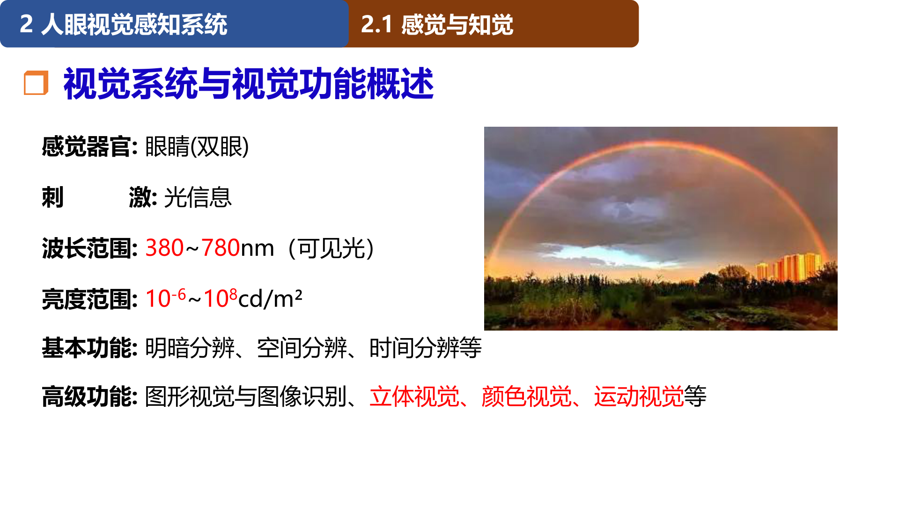

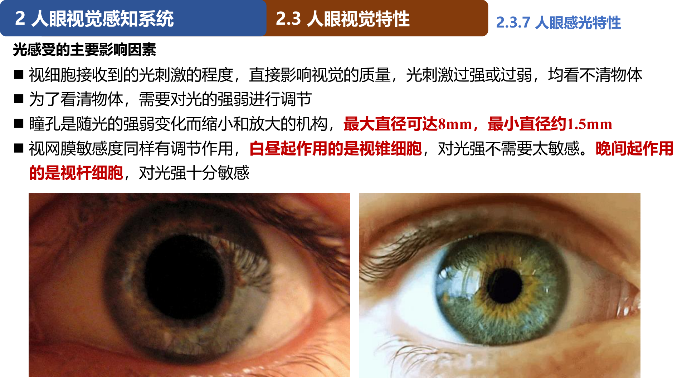

### 小白解释

把人眼看成一台天然相机：

- 角膜、晶状体：像镜头，让光线聚焦。
- 瞳孔：像光圈，强光下缩小，弱光下放大。
- 视网膜：像相机传感器，图像最终落在这里。
- 黄斑/中央凹：精细视觉区域，中央凹最敏锐。
- 视神经盘：没有感光细胞，对应生理盲点。

### 考试答法

`视网膜是人眼接收视觉信息的成像位置，可类比为相机传感器；瞳孔控制进入眼睛的光量，可类比光圈；中央凹位于黄斑中心，是视力最敏锐的位置。白昼主要由视锥细胞工作，晚间弱光环境主要由视杆细胞工作。`

---

## 5. 人眼空间分辨率、1′、正常视力和 E 视标

### 课件原话 / 定义

课件《2.3 人眼视觉特性》p.3-p4 对空间分辨率的核心表述是：它反映光学系统分辨物体细节的能力，可理解为 `能分辨邻近两个点的最小夹角`。课件 p.8 把视网膜细胞最小距离换算到约 `60″ = 1′`。

课件 p.10 和 p.20 重点讲正常视力。p.20 原题是：`正常视力标准规定，能分辨多大视角的视力为正常视力（记为 5.0）？` 答案是 `1′`。

### 原 PPT

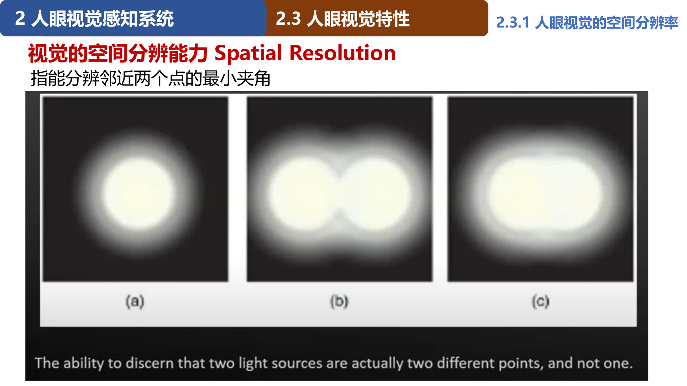

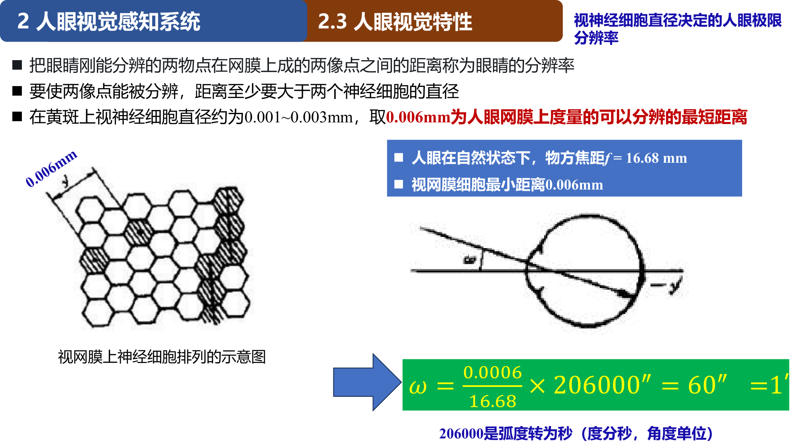

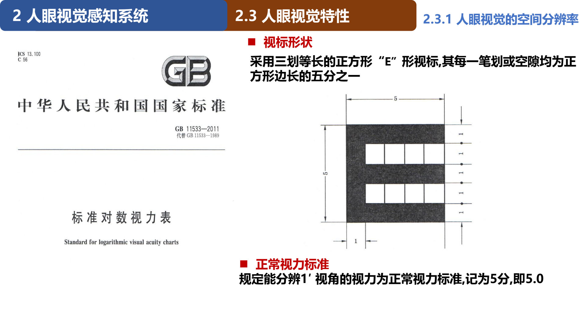

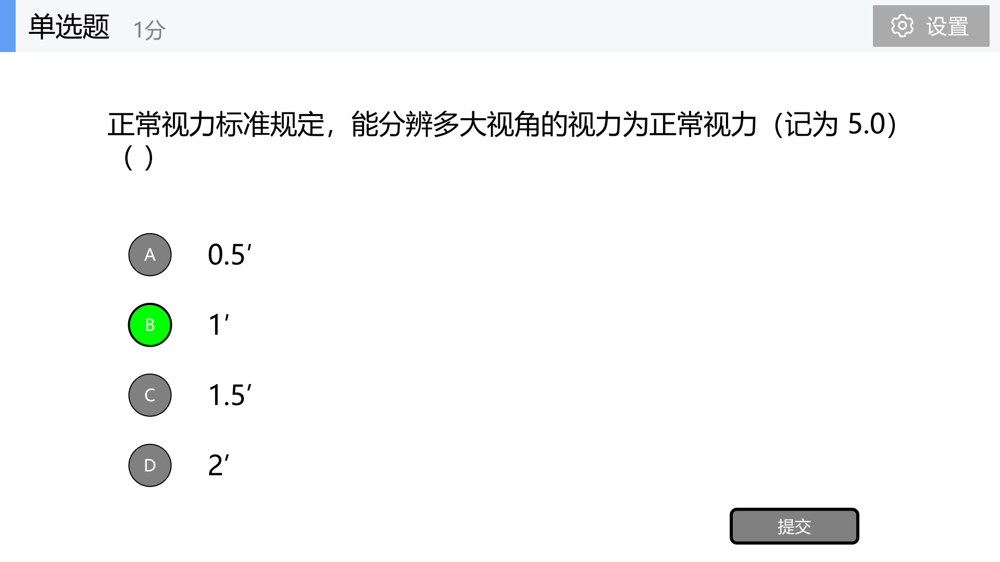

### 小白解释

`1′` 不是一分钟时间，而是 `1 角分`。角度单位里 `1° = 60′`。正常视力 5.0 的意思是：在标准条件下，人眼能分辨大约 `1′` 视角对应的细节。

E 视标为什么和这个有关？因为 E 字的每一笔和每个空隙都被设计成整体的 `1/5`，它是在标准化地测试你能不能分辨细节方向和间隔。

### 课内题目变体

课件 p.14 有 Retina 屏计算题：25 cm 观看距离、人眼视角分辨率 `1′`，估算像素间距或 ppi。

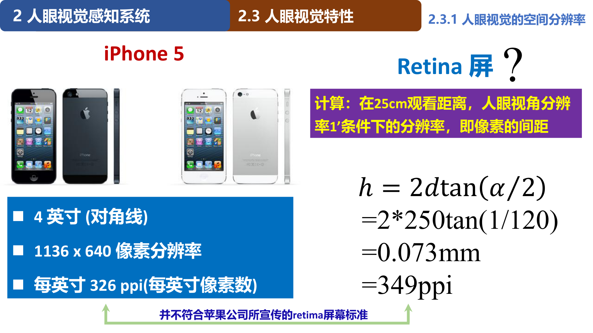

### 老师可能怎么加深考

如果给观察距离 `L` 和角度 `θ=1′`，让你算最小可分辨间距，用小角度近似：

```text
s ≈ L * θ
1′ = (1/60)° ≈ 2.91e-4 rad
```

比如 `L=25cm`，则 `s≈0.25*2.91e-4=7.28e-5m=0.0728mm`。这就是 Retina 屏为什么要让像素间距小到人眼分不出来。

### 考试答法

`人眼空间分辨能力表示分辨相邻细节的能力。正常视力标准中，能分辨 1′ 视角的细节记为 5.0。E 视标通过标准笔画宽度和空隙来检测这种最小分辨能力。`

---

## 6. 瑞利判据和瑞利判据计算

### 课件原话 / 定义

课件 p.5 对瑞利判据的原话是：`点物 S1 的艾里斑中心恰好与另一个点物 S2 的艾里斑边缘相重合时，恰可分辨两物点`。课件 p.17 的题目把瑞利判据表述为：评价人眼空间分辨率的重要依据，用于判断是否能 `恰可分辨两个物点`。

### 原 PPT

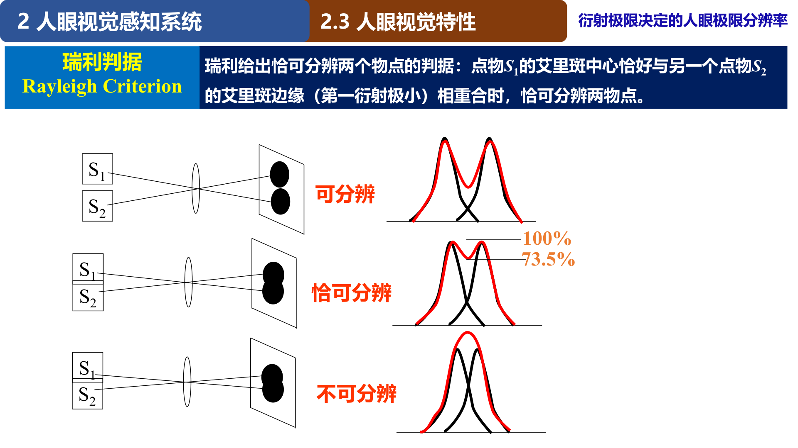

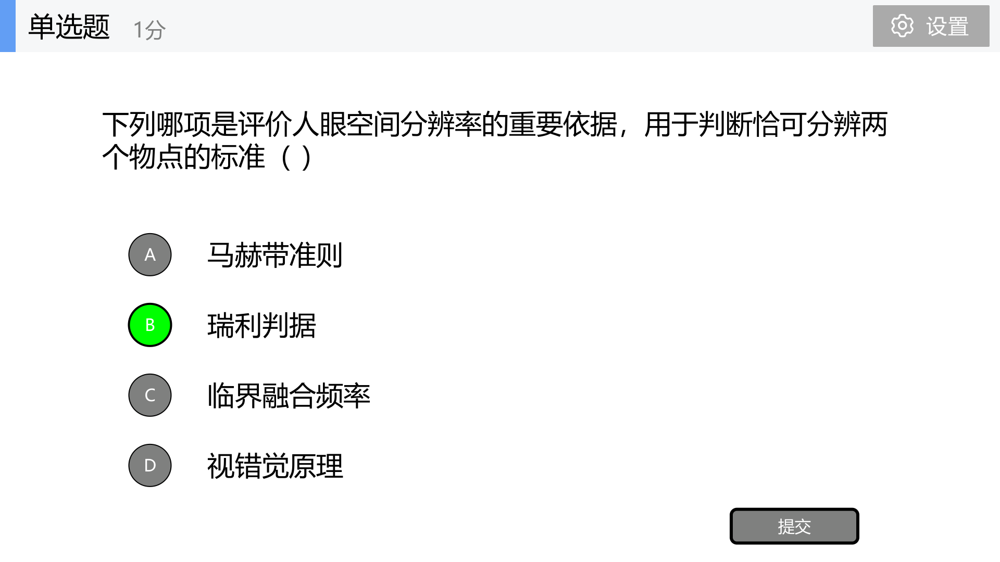

### 小白解释

空间分辨率问的是“能不能看成两个点”。瑞利判据给了一个更物理的判断标准：两个点的衍射图样达到某个临界关系时，算刚好能分开。

### 老师可能怎么加深考

如果题里出现波长 `λ`、孔径 `D`、最小角分辨率，往瑞利判据计算靠；如果题里出现观察距离和 `1′`，往人眼最小分辨间距靠。二者都在问“两个点最小隔多远/多大角度才能分开”，只是一个偏衍射物理，一个偏人眼视角。

### 考试答法

`瑞利判据是判断两个点目标刚好可分辨的经典标准，可用于评价人眼或光学系统的空间分辨能力。它本质上给出了最小角分辨率的判据。`

---

## 7. 视觉残留、时间积分和眨眼时间

### 课件原话 / 定义

课件 p.22 写：影像会继续在视网膜上保留大约 `0.1 至 0.4 秒`，这种生理现象被称为 `视觉暂留现象（或视觉残留）`。课件《2.1&2.2》p.67 写：每分钟眨眼 10 余次，平均每次眨眼时间大约 `0.3~0.4 秒`，每两次眨眼之间相隔约 `2.8~4 秒`。

### 原 PPT

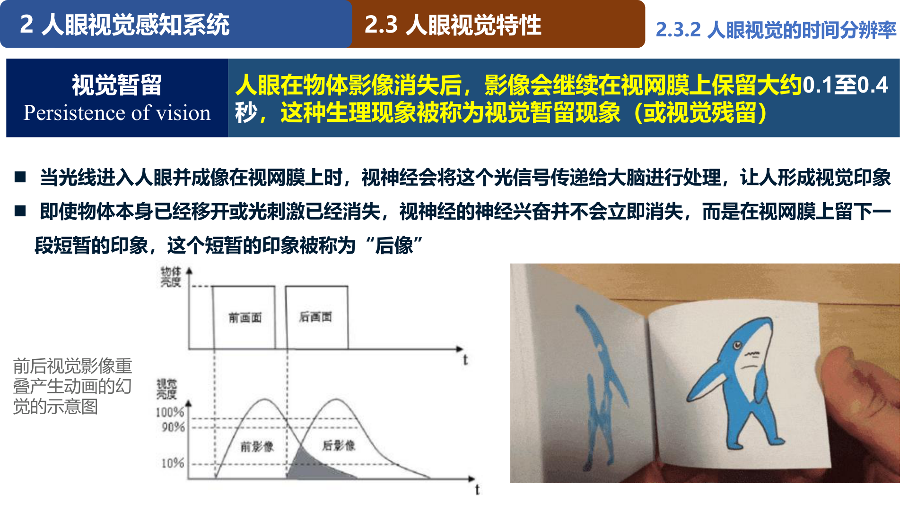


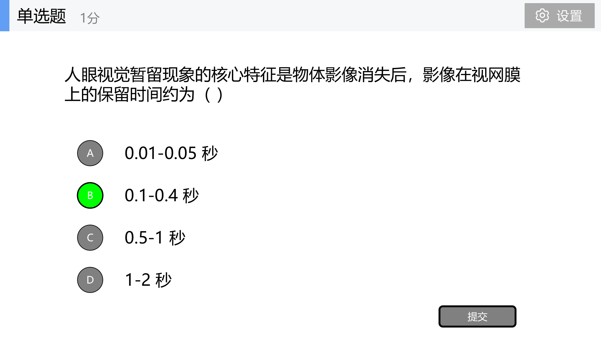

### 小白解释

视觉残留就是图像消失后，视觉印象不会瞬间归零，会短暂停留。电影和动画看起来连续，就和这种时间积分有关。

### 考试答法

`视觉残留指外界刺激消失后，视觉印象仍在视网膜或视觉系统中短暂保持的现象，约 0.1~0.4 秒。它体现人眼视觉系统的时间积分特性，是视频和动画产生连续视觉感的重要基础。`

如果考眨眼：`人眼每分钟眨眼 10 余次，平均每次眨眼约 0.3~0.4 秒，两次眨眼之间约 2.8~4 秒。`

---

## 8. 视错觉 visual illusion、原因和大猩猩实验

### 课件原话 / 定义

你划了 `视错觉（visual illusion）`、`视错觉原因`、`看不见的大猩猩`。课件 p.46 有题：`视错觉产生的本质原因是？` 子 agent 提取到课件表述：视错觉和 `视网膜物理输入与大脑视皮层感知不一致`、`以往习惯经验或不当参照形成的错误认知` 有关。p.50 是大猩猩注意力实验，关键词是 `选择性注意` 和 `注意盲视`。

### 原 PPT

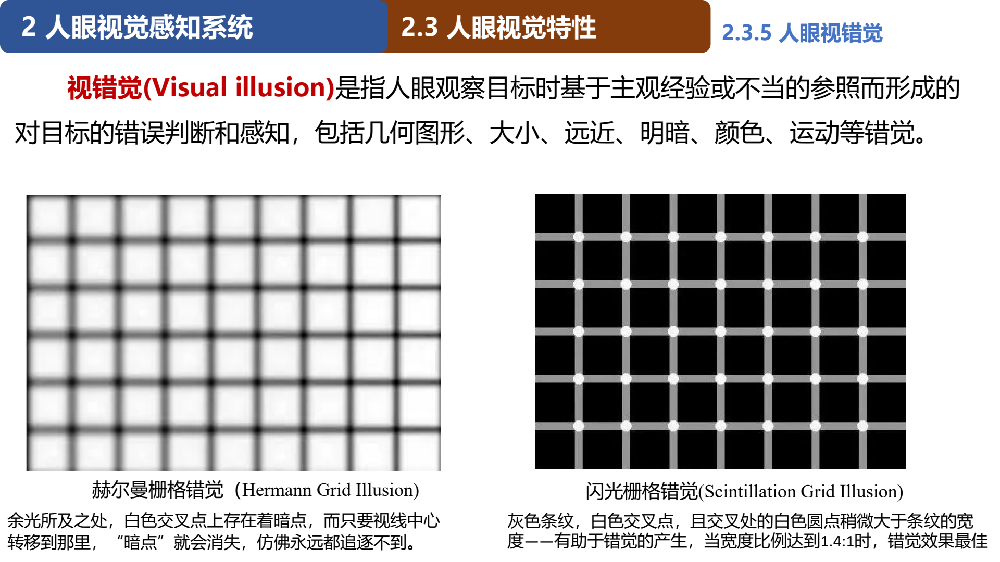

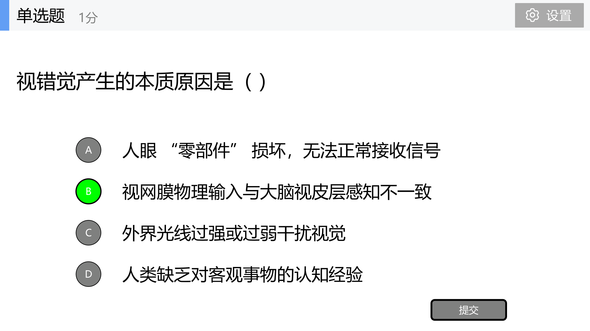


### 小白解释

视错觉不是眼睛坏了，而是大脑在“解释图像”时被背景、对比、经验、注意力带偏。人眼不是照相机，它会主动加工信息。

大猩猩实验说明：你眼睛接收到信息，不代表你注意到了信息。当注意力集中在数球、找目标这类任务上，人会忽略明显出现的东西。

### 考试答法

`Visual illusion 是视错觉，指视觉系统在背景、对比、上下文经验和神经加工影响下，对客观对象产生偏差知觉。看不见的大猩猩实验体现选择性注意和注意盲视，说明“看见”不等于“注意到”。`

---

## 9. 相机动态成像范围和 HDR

### 课件原话 / 定义

课件 p.61 写：`最大亮度值与最小亮度值之间的范围即称为相机成像的动态范围`。课件还给出：人眼在成像时可接收约 `80~120dB` 的光照动态范围，成像器件约 `40~80dB`。课件 p.67 有题：动态范围大于 `4 个量级（80dB）` 的图像称为 HDR 图像。

### 原 PPT

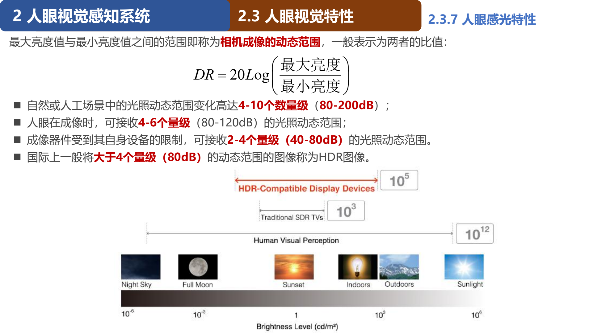

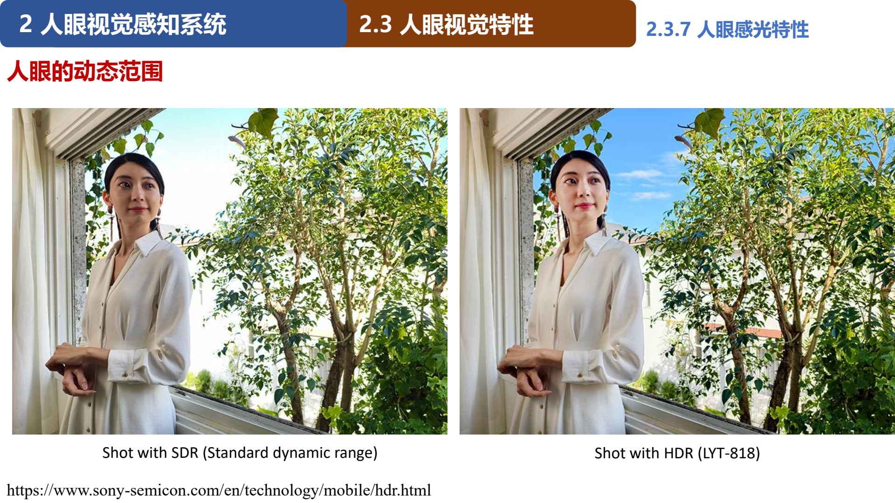

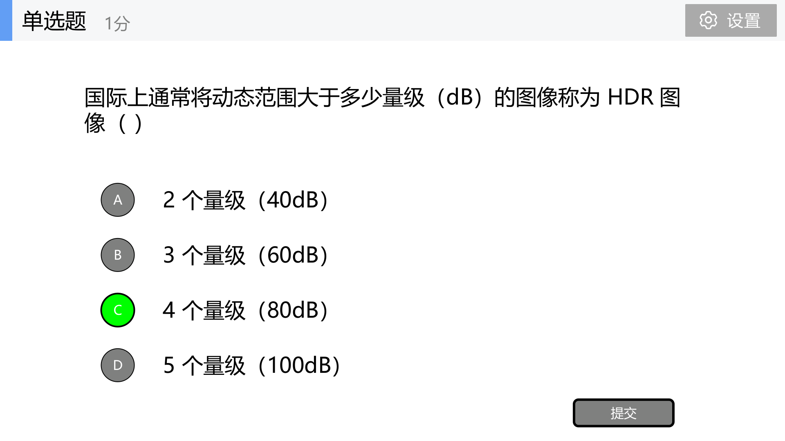

### 计算题模板

课件 p.68 有动态范围计算题。常见公式：

```text
DR(dB) = 20 log10(最大亮度 / 最小亮度)
```

如果最大亮度是 `10^6`，最小亮度是 `10^-3`，比值是 `10^9`，所以 `DR = 20 * 9 = 180 dB`。

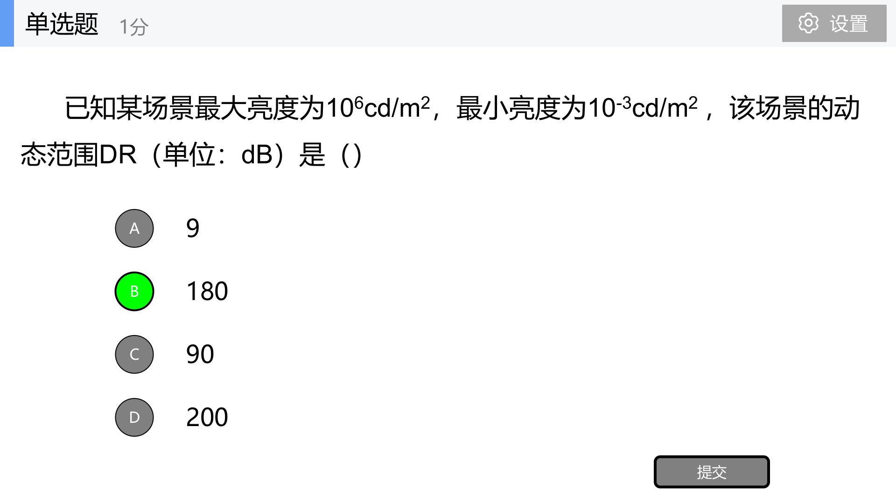

### 考试答法

`动态范围是成像系统可记录的最大亮度与最小亮度范围，常用 dB 表示。HDR 是 High Dynamic Range，高动态范围成像，国际上一般将大于 4 个量级即 80dB 的动态范围图像称为 HDR 图像。`

---

## 10. 光谱光效率函数、光通量、辐通量、照度

### 课件原话 / 定义

课件《2.4 光度学与色度学》p.5-p7 写：人眼对不同波长的电磁辐射具有不同响应灵敏度，对 `555nm` 最敏感，因此引入光谱光效率函数。

课件 p.8 写：`辐通量：单位时间内通过某截面的所有波长的总电磁辐射能量。(瓦：W)`；同页写：`光通量：可见光对人眼的视觉刺激程度的量，单位为流明（lm）`。

课件 p.17 写：`照度是指落到某一面元上的光通量与这个面元面积之商`，单位是 `勒克斯（lx）`，`1 lux = 1 lm/m^2`。

### 原 PPT

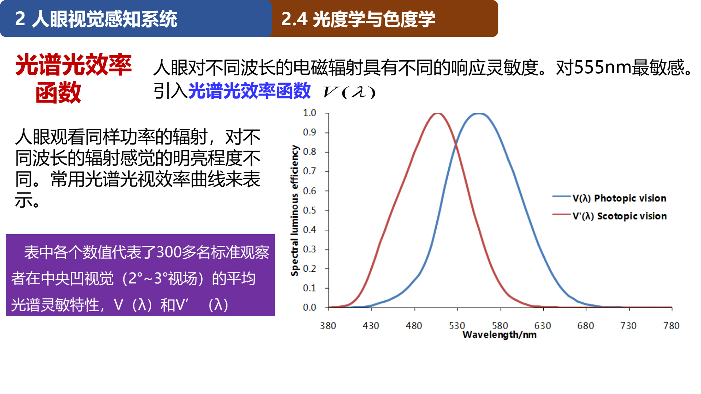

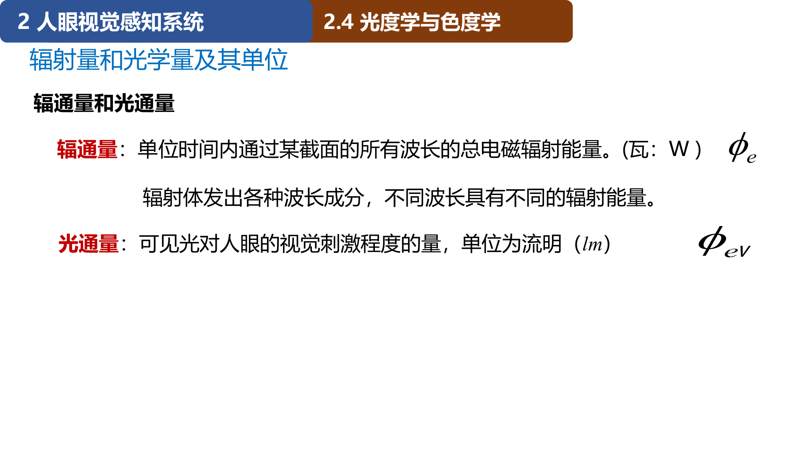

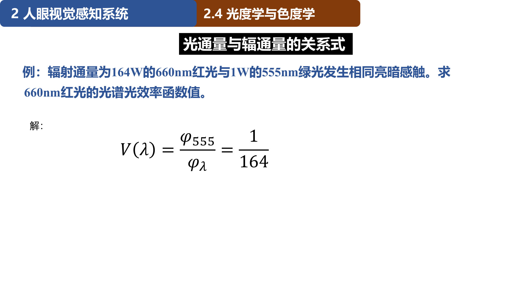

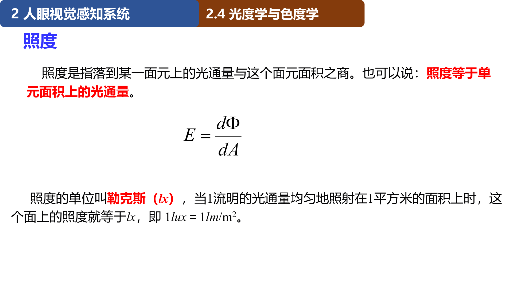

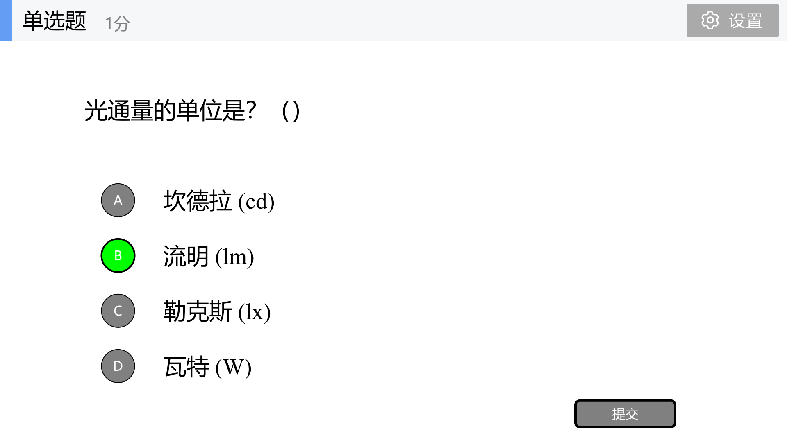

### 老师可能怎么加深考

这一块不要只背单位，要能比较：

```text
辐通量：客观物理能量，所有波长，总电磁辐射能量，W。
光通量：考虑人眼敏感度后的可见光视觉刺激量，lm。
照度：光通量除以面积，lx = lm/m^2。
```

如果题目给 `555nm` 和其他波长的辐射通量比较，核心是：同样物理功率不等于同样视觉亮度，因为人眼对不同波长敏感度不同。

### 考试答法

`辐通量是单位时间内通过截面的总电磁辐射能量，单位 W；光通量是在可见光范围内考虑人眼视觉刺激程度后的量，单位 lm；照度是单位面积接收的光通量，单位 lx。光谱光效率函数描述人眼对不同波长光的敏感程度，明视觉峰值约 555 nm。`

---

## 11. 颜色匹配实验

### 课件原话 / 定义

课件 p.62 的课内题强调：三刺激值的核心是匹配待测颜色所需三原色的数量。课件 p.45 附近讲颜色匹配实验和三刺激值。

### 原 PPT

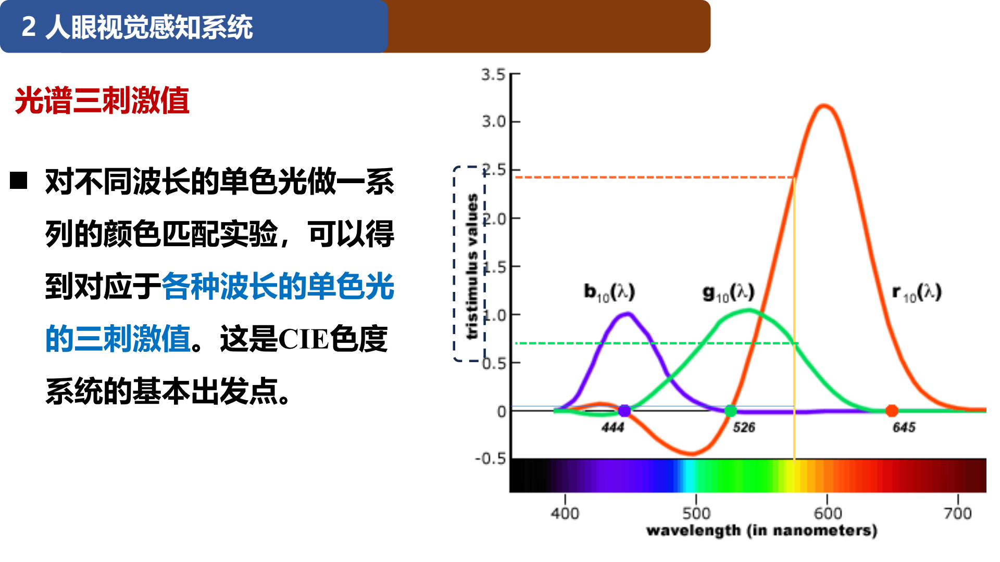

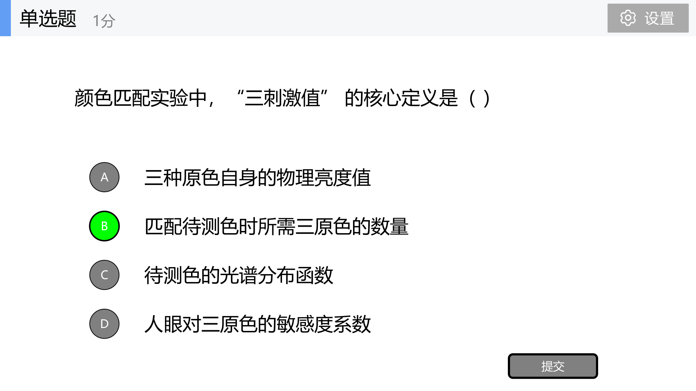

### 小白解释

颜色匹配实验想说明：颜色感知可以用三种原色的组合来匹配。三刺激值不是说原色自己多亮，而是说“要用多少 R、G、B 才能让人眼看起来一样”。

### 考试答法

`颜色匹配实验通过调节三原色刺激值，使混合光与待测颜色产生相同视觉效果。它说明颜色可以用三刺激值表示，是 CIE 色度系统的基础。`

---

## 12. 光源对于视觉成像的影响因素

### 课件原话 / 定义

课件《视觉系统构成》p.4 写：照明的目的是让被测物的重要特征显现，而抑制不需要的特征；重要因素包括光源和被测物的光谱，相互作用包括镜面反射、漫反射、透射、吸收、散射。课件 p.27-p31 连续出现照明方式选择题。

### 原 PPT

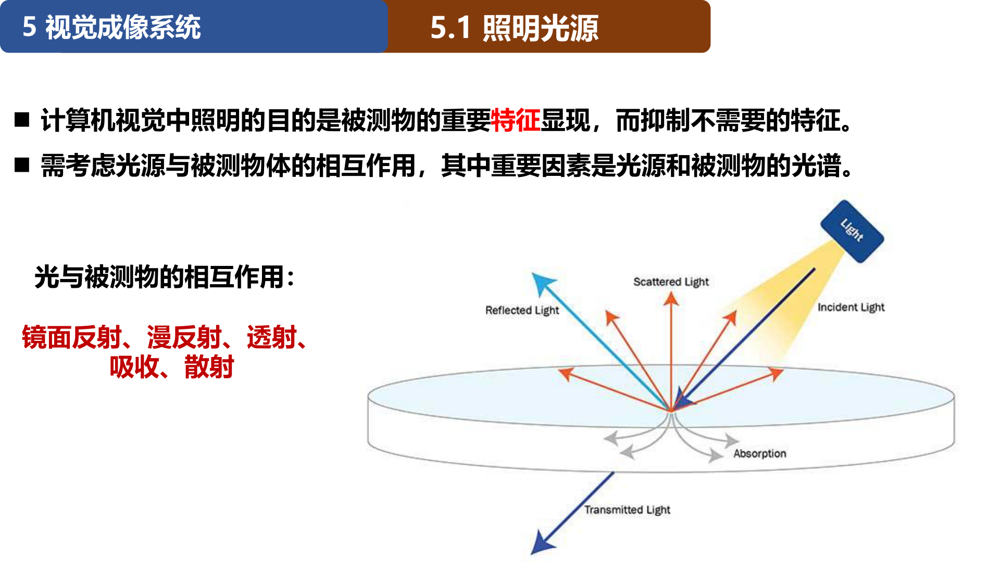

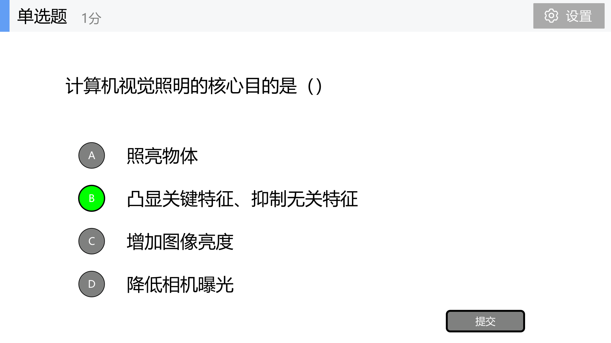

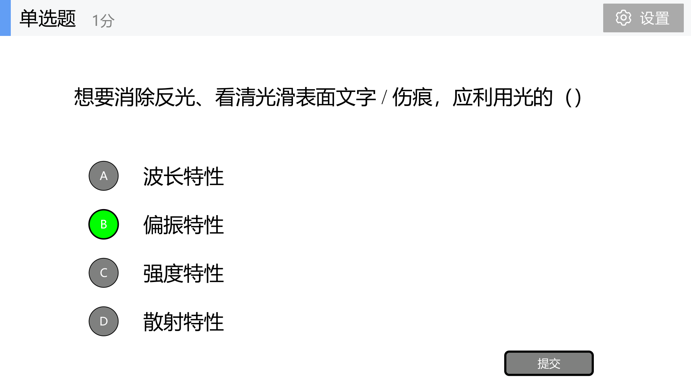

### 小白解释

机器视觉里，光源不是“越亮越好”，而是要让目标特征更明显。不同光源改变的是：亮度、方向、波长、均匀性、反射方式、偏振状态。

### 考试答法

`光源会通过光强、光谱成分、入射方向、扩散程度、偏振状态以及物体表面反射特性影响成像质量。机器视觉照明的核心目标是增强目标特征、抑制干扰背景，提高后续检测和识别可靠性。`

---

## 13. 镜头概念、成像镜头作用、镜头分辨率、F 数和光圈

### 课件原话 / 定义

课件 p.34 写：`视场(Field of view, FOV)` 是观测物体的可视范围；`工作距离(Working Distance, WD)` 是从镜头前部到被检验物体的距离；`分辨率` 是图像系统可以测到的最小可分辨特征尺寸。

课件 p.41 写：`镜头的分辨率是指镜头再现物体细部的能力`。p.42 写：`镜头F数（F-number）是衡量镜头光圈大小的专业术语，定义为镜头焦距与有效孔径直径的比值`，公式是 `F=f/D`。p.43 补充：`光圈每增加一档，光照度增加一倍`。

### 原 PPT

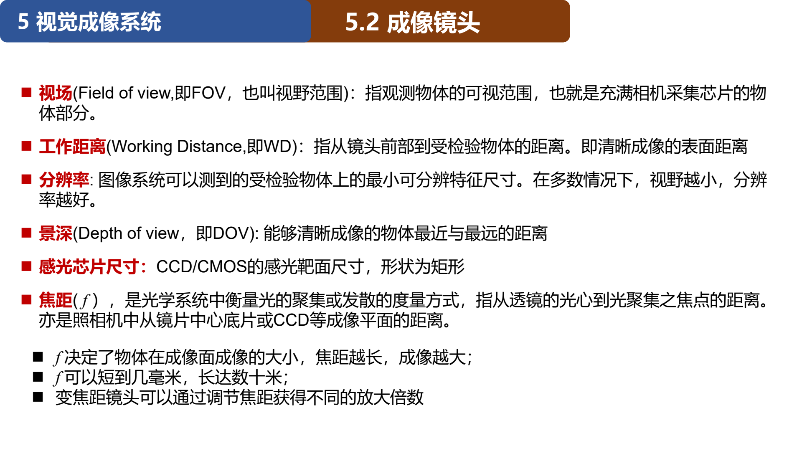

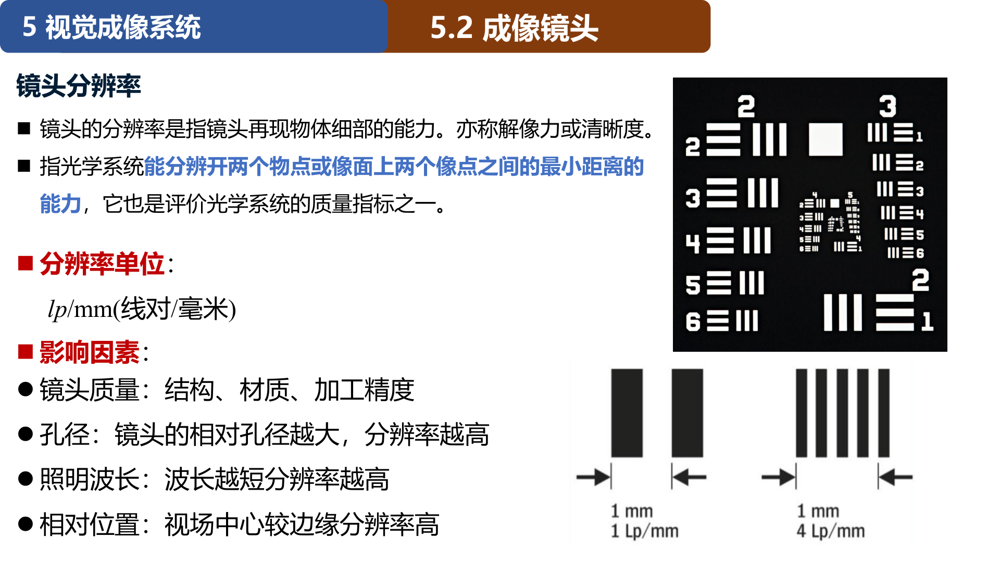

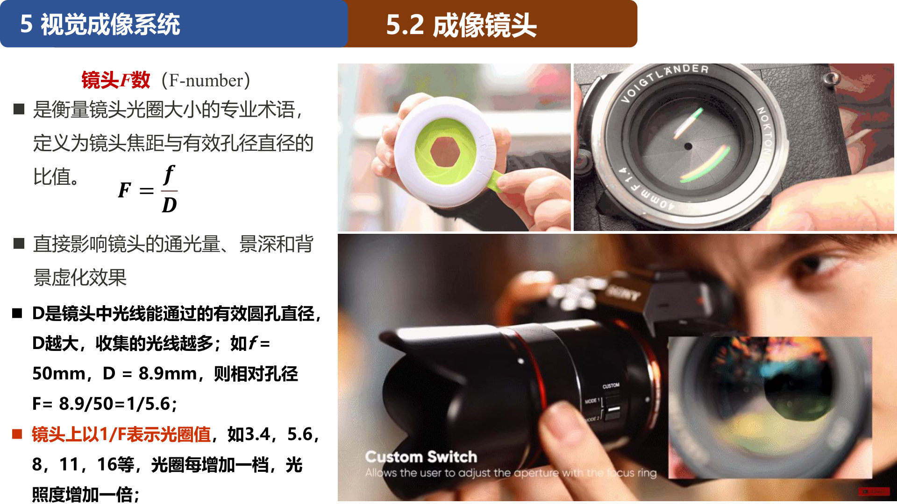

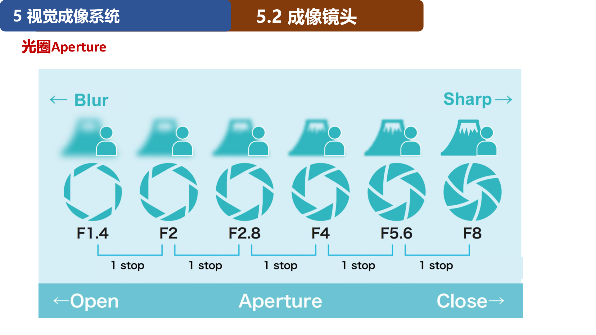

### 课内题目

p.60 问：`镜头分辨率的单位是（）`，答案是 `lp/mm`。p.58 问工作距离，p.59 问焦距越长成像越大。

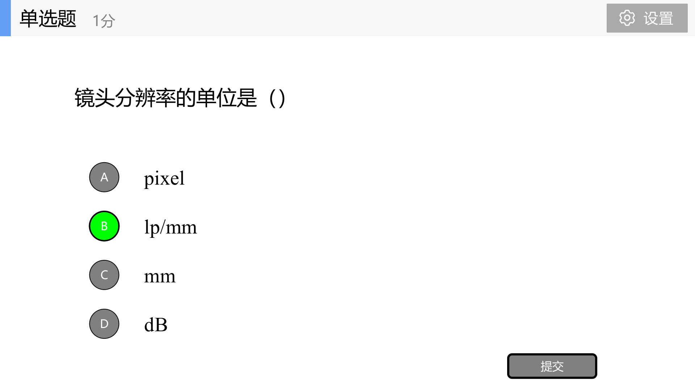

### 老师可能怎么加深考

镜头这块最可能把几个参数混在一起问：

```text
FOV：视场，看得多宽。
WD：工作距离，镜头前端到物体清晰成像表面的距离。
分辨率：能分辨的最小细节。
焦距 f：影响成像大小和视场。
F数：f/D，影响进光量和景深。
```

如果题问“焦距越长，像会怎样”，答 `成像越大、视场越小`；如果题问“工作距离是什么”，答 `镜头前端到被测物清晰成像表面的距离`。

### 考试答法

`成像镜头的作用是把来自物体的光线聚焦到成像面。镜头分辨率表示镜头再现物体细部的能力，常用 lp/mm 表示。F 数定义为焦距与有效孔径直径之比，影响通光量、景深和背景虚化。`

---

## 14. 远心镜头、CCD 尺寸、彩色 CCD 原理、1 英寸

### 课件原话 / 定义

课件 p.64 写：固态图像传感器主要有 `电荷耦合器件（Charge Coupled Device，CCD）` 和 `互补金属氧化物半导体图像传感器（CMOS）`。p.100 问 Bayer 滤波阵列中 2x2 单元数量最多的是 `G`。

课件 p.51-p55 讲远心镜头，重点是消除物方由于调焦不准带来的误差。p.94 对工业相机规格给出：`1 英寸 CCD 对应 12.8mm × 9.6mm`。

### 原 PPT

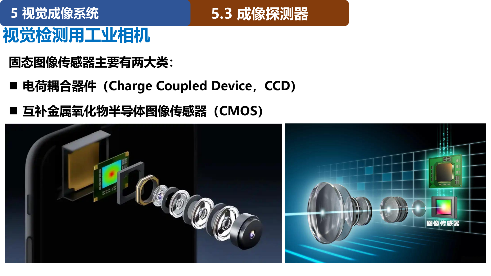

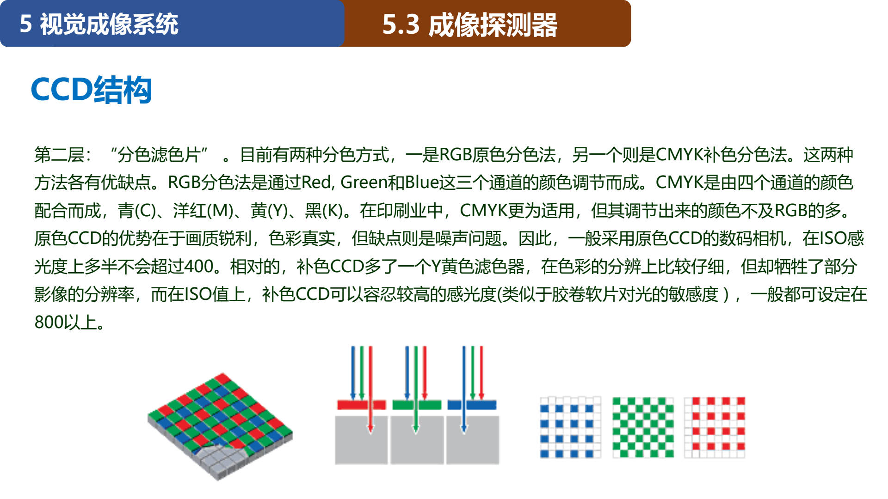

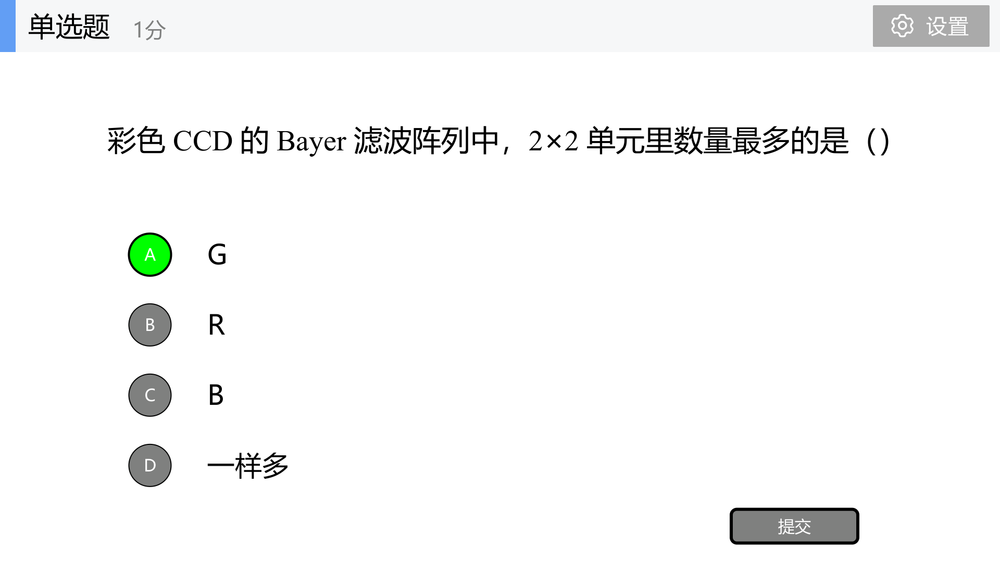

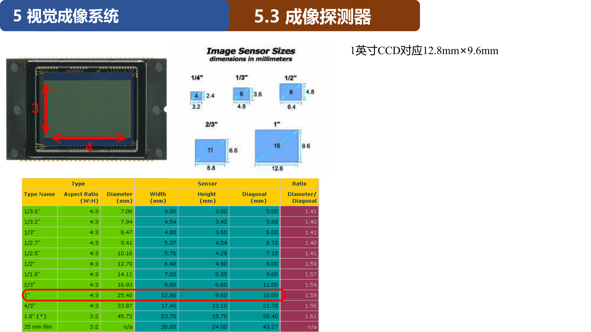

### 小白解释

CCD 是把光信号变成电信号的传感器。普通感光单元主要记录光强，不天然知道颜色。彩色 CCD 要靠滤色片把红、绿、蓝分开，常见 Bayer 阵列是 `2G + 1R + 1B`，绿色最多，因为人眼对亮度和绿色附近更敏感。

`1 inch = 25.4 mm` 是普通单位换算；如果题目问课件里的 `1 英寸 CCD` 靶面尺寸，要按课件答 `12.8mm × 9.6mm`。

### 彩色 CCD 画图题怎么画

如果题目说“图要画”，最简单画一个 2x2 Bayer 单元：

```text
G R
B G
```

旁边标注三层结构：`微型镜头 -> 分色滤色片 -> 感光层`。再写一句：每个像素只测一个颜色通道，通过插值/重建得到完整 RGB 彩色图像。

### 考试答法

`CCD = Charge Coupled Device，电荷耦合器件。彩色 CCD 通过滤色片阵列让不同像素接收不同波段的光，再通过插值恢复彩色图像。Bayer 阵列中绿色像素通常最多。远心镜头可以减小透视误差，适合高精度尺寸测量。`

---

## 15. 运动图像清晰成像

### 课件题目

课件 p.99 问：`镜头与相机配合时，无拖影清晰成像的核心原则是（）`，答案是 `曝光时间内像移 ≤ 1 个像素`。

### 原 PPT


### 小白解释

如果物体运动很快，曝光时间又长，那么物体在传感器上的像会拖出一段距离，就是运动模糊。要清晰，就要让曝光时间内的像移尽量小，常用原则是不要超过 1 个像素。

### 考试答法

`运动目标清晰成像的核心是控制曝光时间内的像移，通常要求像移不超过 1 个像素。它与目标速度、曝光时间、成像倍率、像元尺寸和相机相对运动方向有关。`

---

## 16. 几何变换的矩阵形式、坐标系定义和转换

### 课件原话 / 定义

课件《光学成像原理&相机标定》p.18 出现问题：`怎样由齐次坐标求正常化齐次坐标？` 这是几何变换矩阵形式的典型入口。

### 原 PPT

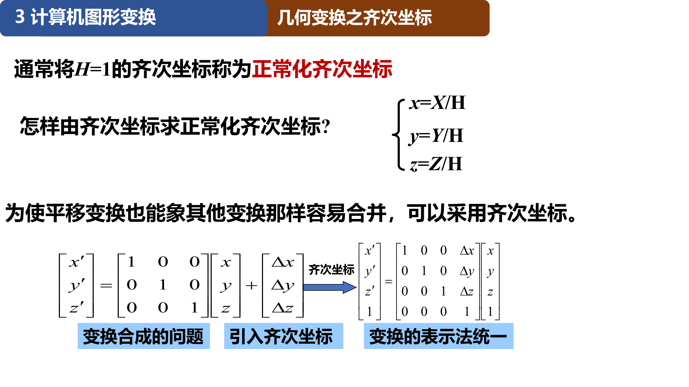

### 小白解释

一个点会经历多个坐标系：

| 坐标系 | 含义 |
|---|---|
| 世界坐标系 | 真实三维世界里的位置 |
| 相机坐标系 | 以相机为原点看这个点 |
| 图像坐标系 | 投影到成像平面后的连续坐标 |
| 像素坐标系 | 数字图像里的行列像素位置 |

用矩阵表示，是因为旋转、平移、缩放、投影都能写进统一公式。齐次坐标最大的好处是把平移也放进矩阵乘法里。

### 考试答法

`世界点通常先由世界坐标系通过外参 R,t 变换到相机坐标系，再通过透视投影到图像坐标系，最后由内参和像素尺度映射到像素坐标系。几何变换常用齐次坐标和矩阵表示，因为便于统一表达平移、旋转、缩放和投影，并能通过矩阵连乘组合多个变换。`

---

## 17. 相机内参数、相机标定和标定板作用

### 课件原话 / 定义

课件 p.61 提到：`K 有多少个自由度？回答：5 DOF`，并说透视投影矩阵是 `3*4`，有 `11 个自由度`，包括 `5 个内参数自由度` 和 `6 个旋转平移量`。

课件 p.88-p90 进入相机标定，p.90 的目标是 `计算摄像机内、外参数`。课件 p.112-p122 提到：`利用结构已知、精度很高的空间参照物：标定板`。

### 原 PPT

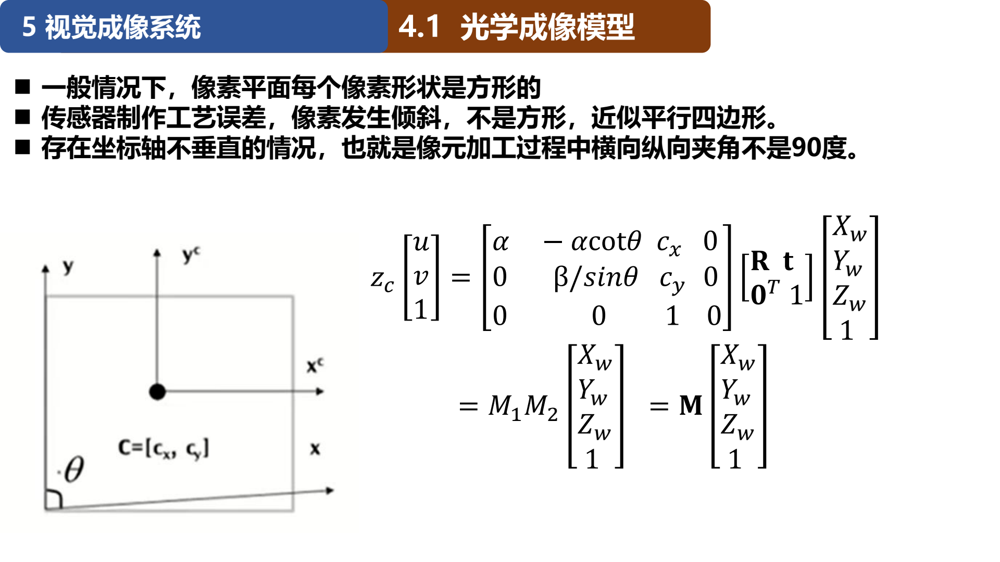

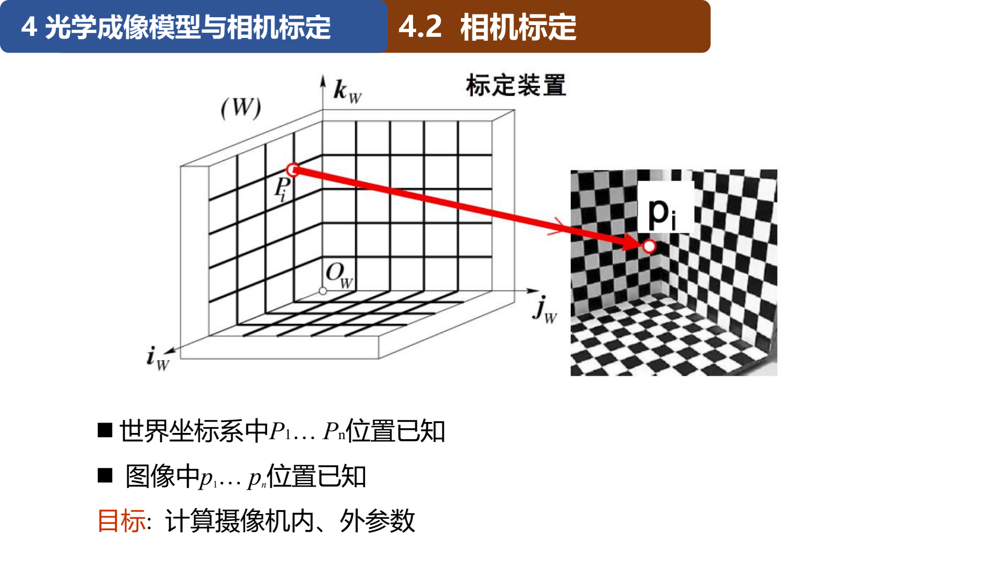

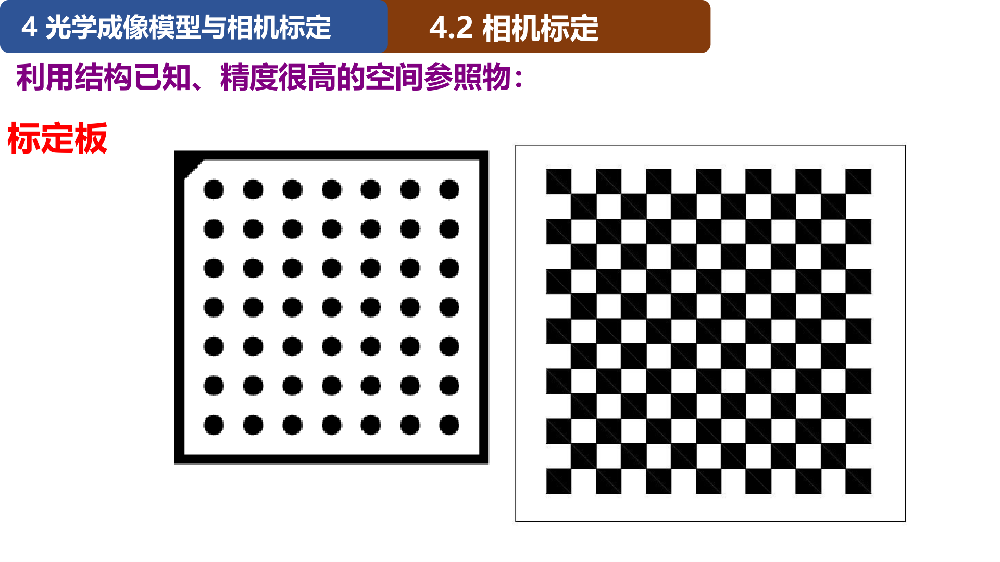

### 课内题目

p.78 问：`小孔成像模型（线性成像模型）中，摄像机内参数不包括以下哪一项？` 答案是 `旋转矩阵 R`，因为 R 是外参。

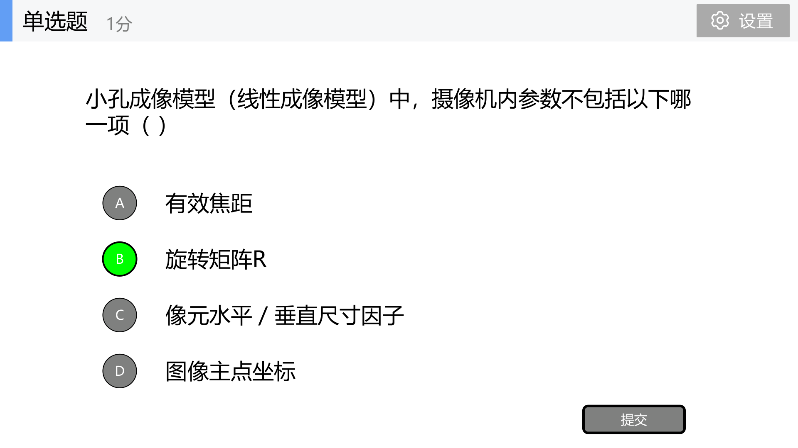

### 老师可能怎么加深考

这块很容易出“内参不包括哪个”的单选，也容易出简答。要把三个层次分清：

```text
内参 K：焦距、主点、像素尺度、坐标轴倾斜等，相机内部参数。
外参 R,t：相机相对世界坐标系的姿态和位置。
畸变参数：径向畸变、切向畸变、仿射/非正交修正等，更接近真实镜头。
```

如果题问高精度测量该选什么模型，课件 p.79 的方向是：应优先选择包含径向畸变、切向畸变及仿射/非正交变形的复杂非线性模型。

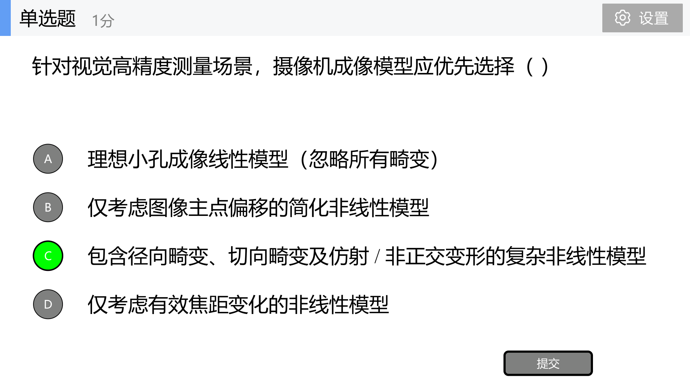

### 考试答法

`相机标定是求解成像模型中的内参数和外参数，有时还包括畸变参数。标定板提供结构已知、精度较高的空间参考点，使世界坐标点与图像点建立对应关系。相机内参数描述相机内部成像几何，旋转矩阵 R 和平移 t 属于外参数。`

---

## 18. 理想光学系统：给物画像作图题

### 课件原话 / 定义

课件 p.38 写：`当一个理想光学系统的主平面和焦点位置确定以后，可通过作图法确定任何一个物点、直线或平面的像。` p.50 课内主观题要求：画出理想光学系统简化图，并画出平行于光轴的出射光线。

### 原 PPT

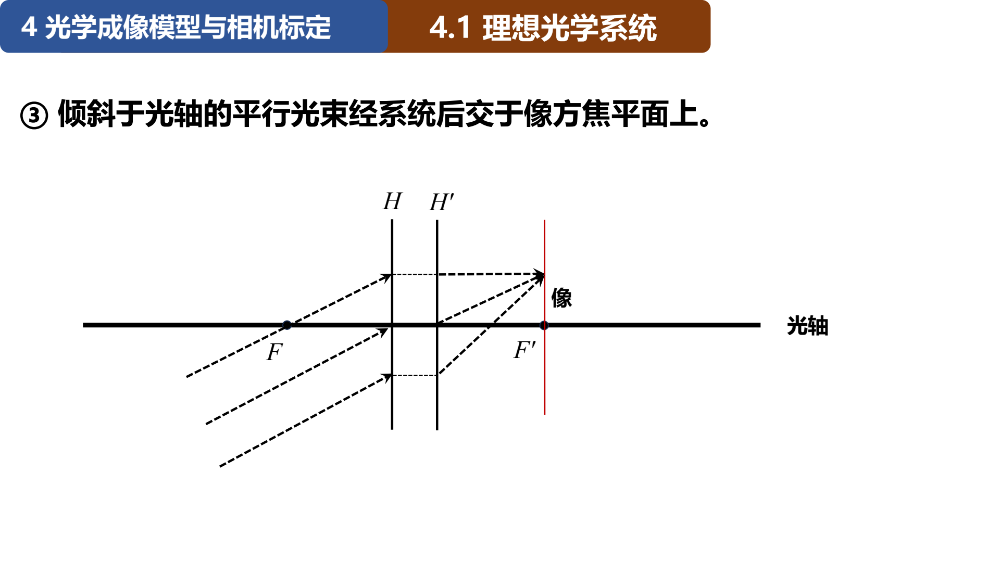

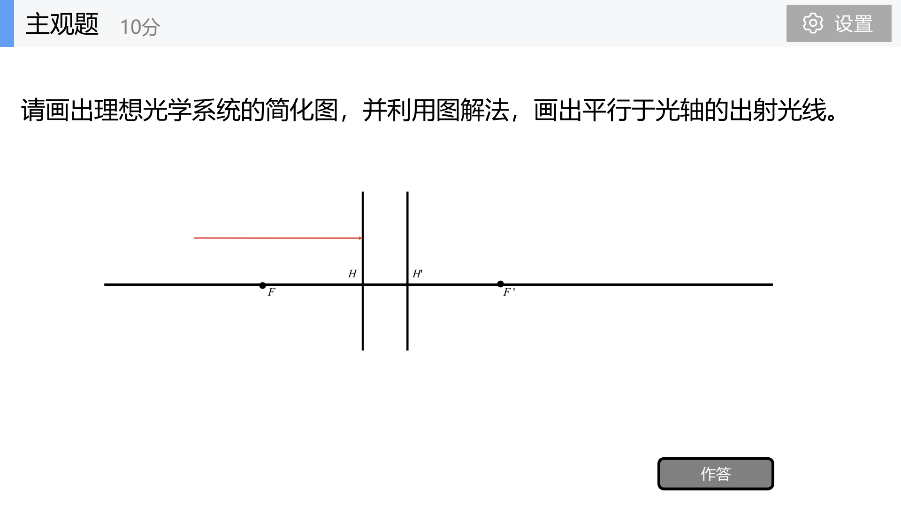

### 自绘辅助图

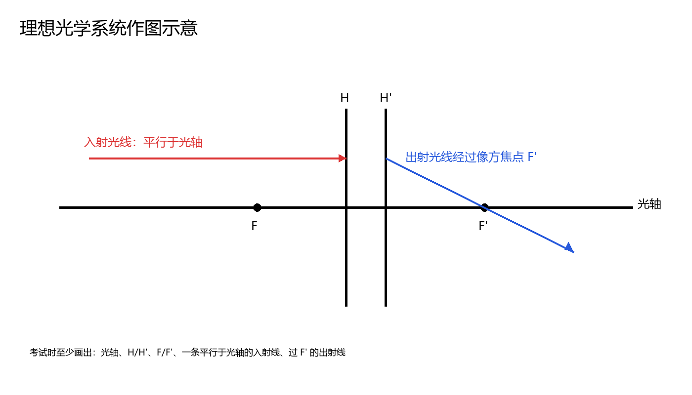

### 小白解释

这题考的不是艺术画图，而是符号是否齐全：光轴、主面 H/H'、焦点 F/F'、入射线、出射线。最关键规律是：平行于光轴的入射光线，经过系统后，出射光线过像方焦点 F'。

### 考试答法

`作图时先画光轴和主面 H、H'，再标出物方焦点 F 与像方焦点 F'。若入射光线平行于光轴，则经过理想光学系统后，出射光线应通过像方焦点 F'。`

---

## 19. 选择焦距、牛顿公式、镜头焦距类型

### 课件原话 / 题目

课件《视觉系统构成》p.47 写选择焦距前提：明确物体尺寸、相机感光靶面尺寸、物体工作距离。p.63 有主观题：已知物体高度 `60mm`、像高 `6.6mm`、工作距离 `WD=200mm`，求放大倍率和焦距。

### 原 PPT

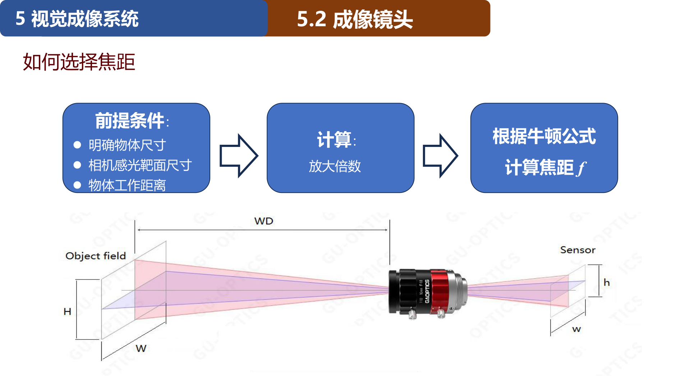

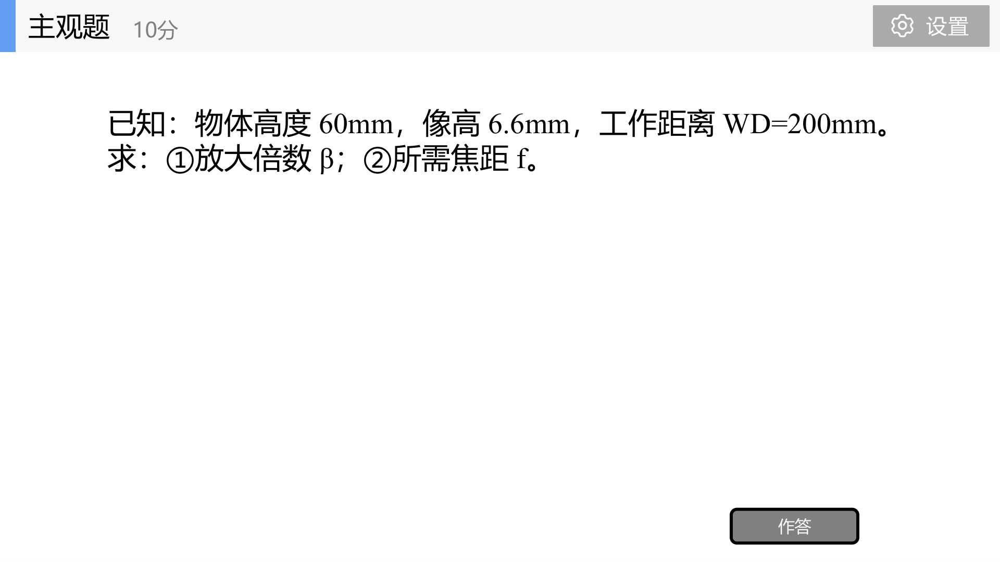

### 小白解释

这类题不要先乱套公式，先找三个量：目标多大、传感器成像面多大、相机离目标多远。先算放大倍率：

```text
β = 像高 / 物高
```

再用课件公式：

```text
f = WD * β / (1 + β)
```

### 考试答法

`β = 6.6 / 60 = 0.11；f = WD*β/(1+β) = 200*0.11/1.11 ≈ 19.82mm。实际选型时再选择接近的标准镜头焦距，如 16mm 或 25mm，并重新检查工作距离和视场。`

---

## 20. 三角化

### 课件原话 / 定义

课件《三角化与极几何》p.5 定义三角化：基于不同相机拍摄图像中的二维像素坐标以及相机之间关系，计算空间点三维坐标。

### 原 PPT

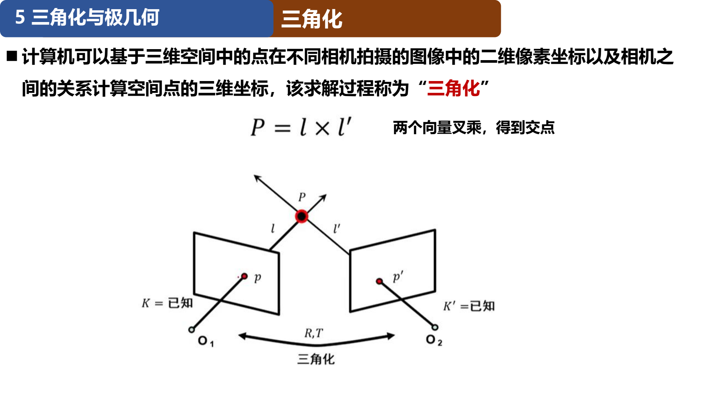

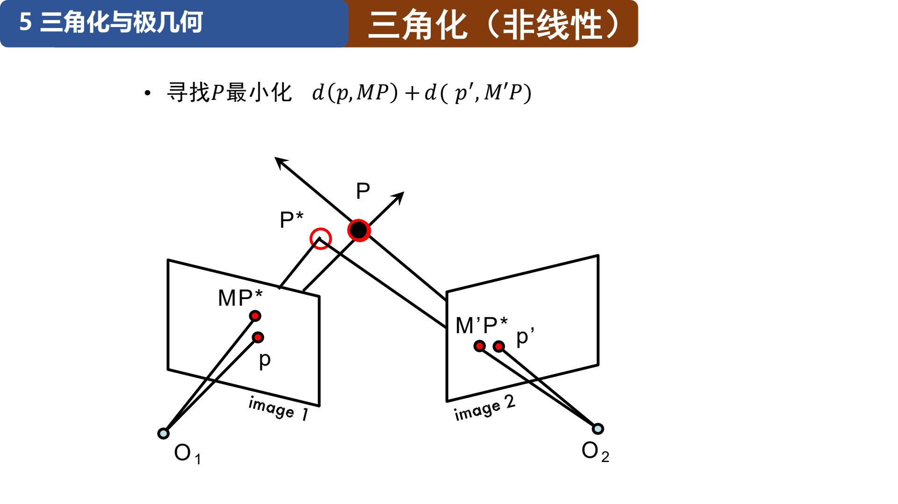

### 小白解释

一个相机看到一个点，只能知道它在一条射线上，不能确定深度。两个相机同时看到同一个点，两条射线理论上相交，交点就是三维位置。现实有噪声，两条射线可能不相交，所以要找误差最小的三维点。

### 考试答法

`三角化是利用同一空间点在两个或多个视图中的二维投影点，以及相机内外参数关系，反求该空间点三维坐标的方法。理想情况下两条反投影射线相交；有噪声时通常用线性或非线性最小化重投影误差求最优点。`

---

## 21. 极点、极线、极平面

### 课件原话 / 定义

课件 p.15 定义：`极平面：过点 P，O1 与 O2 的平面`；`极线：极平面与成像平面的交线`；`极点：基线与成像平面的交点`。

### 原 PPT

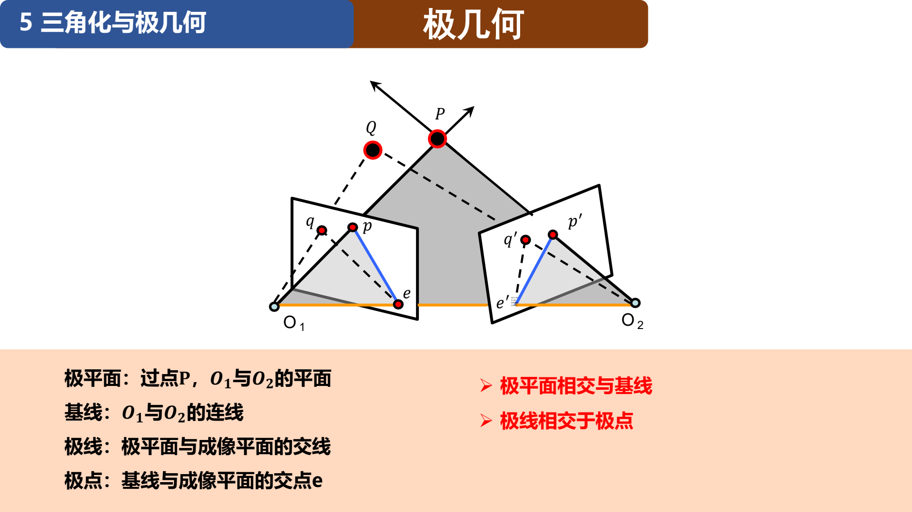

### 自绘辅助图

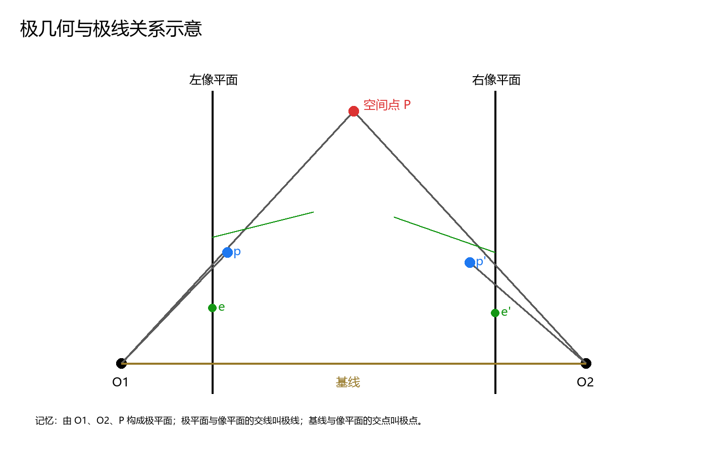

### 小白解释

极几何解决的是：左图看到一个点，右图该去哪里找对应点？答案不是全图乱找，而是在右图一条极线上找。这样二维搜索变成沿线搜索。

### 考试答法

`极平面是由空间点 P 和两个相机中心 O1、O2 共同确定的平面；极线是极平面与图像平面的交线；极点是两相机中心连线即基线与图像平面的交点。极几何约束把对应点搜索限制在极线上。`

---

## 22. 本质矩阵 E、基础矩阵 F、单应矩阵 H

### 课件原话 / 定义

课件把本质矩阵描述为规范化摄像机下两视图极几何关系的代数描述，形式与 `E = T×R` 相关。基础矩阵描述一般透视摄像机两视图图像间的极几何关系，并有秩 2 约束。单应矩阵描述空间平面在两个摄像机下的投影几何，形式可写为 `p' = Hp`。

### 原 PPT

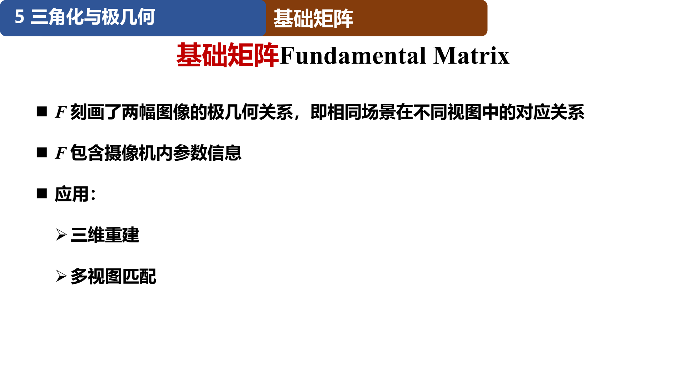

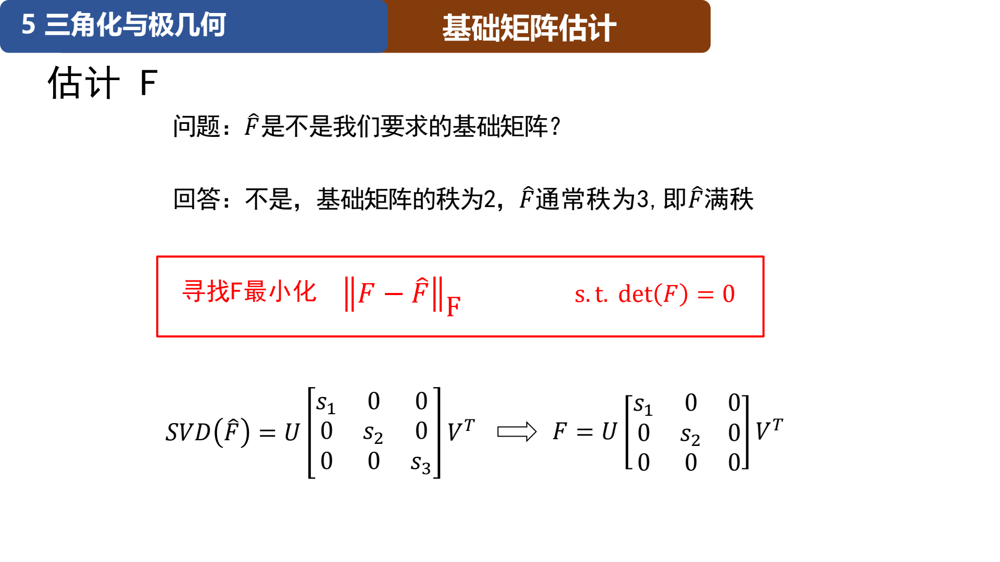

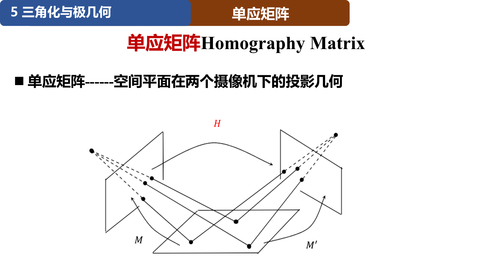

### 小白解释

| 矩阵 | 英文 | 用在哪里 | 关键词 |
|---|---|---|---|
| E | Essential Matrix | 归一化相机坐标 | 已知/去掉内参后的极几何 |
| F | Fundamental Matrix | 像素坐标 | 真实图像点之间的极线约束 |
| H | Homography | 平面到平面 | 同一平面点在两图之间映射 |

### 老师可能怎么加深考

这块非常像综合题里的“概念 + 公式 + 区分”：

```text
E：相机内参已经处理掉，点在归一化坐标里，常和 R、T 关系更直接。
F：真实像素坐标下用，满足 x'^T F x = 0，给出极线约束。
H：不是一般三维场景的极几何，而是平面场景或纯旋转等情况下的图像到图像映射。
```

如果问“基础矩阵为什么秩为 2”，答：基础矩阵来自极几何约束，具有退化结构，理论上秩为 2；实际估计受噪声影响可用 SVD 将最小奇异值置零来强制满足秩约束。

### 考试答法

`本质矩阵 E 描述规范化相机坐标下的两视图极几何关系；基础矩阵 F 描述像素坐标下的一般两视图极几何关系，理论上秩为 2；单应矩阵 H 描述同一空间平面上的点在两幅图像之间的投影映射。`

---

## 23. 平行视图三角测量和双目立体视觉

### 课件原话 / 定义

课件《双目立体视觉》p.20 给出平行双目关系：`pu - pu' = Bf/z`，也就是视差和深度成反比。

### 原 PPT

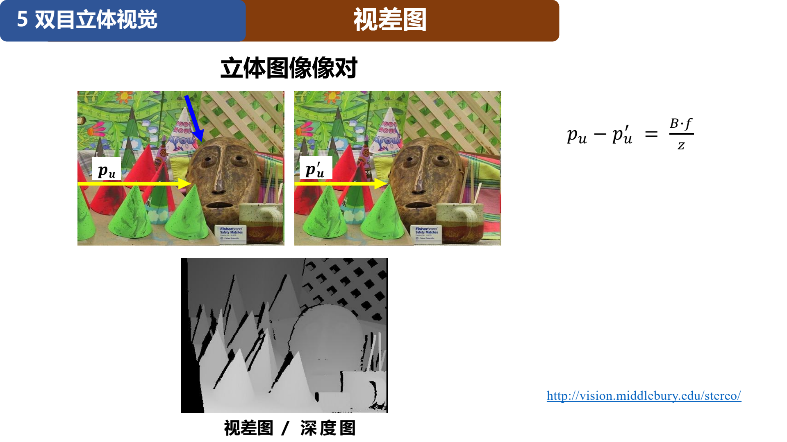

### 计算模板

```text
z = Bf / d
```

其中 `B` 是基线，`f` 是焦距，`d` 是视差。视差越大，深度越小，物体越近。

### 考试答法

`平行双目中，对应点位于同一扫描线附近，视差 d 与深度 z 满足 z = Bf/d。视差越大，目标越近；视差越小，目标越远。`

---

## 24. 图像校正和相关法存在的问题

### 课件原话 / 定义

课件 p.30 讲图像校正：令两图像 `平行`，即共线且行对准。课件 p.40-p50 讲相关匹配窗口和相关法问题，包含透视缩短、遮挡、基线选择、同质区域、重复性模式等。

### 原 PPT

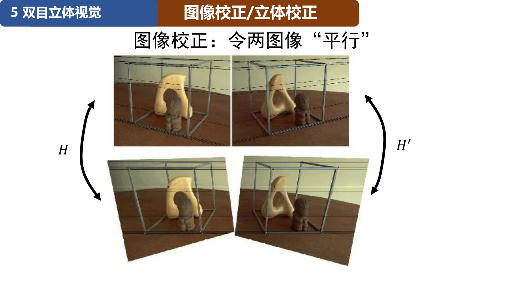

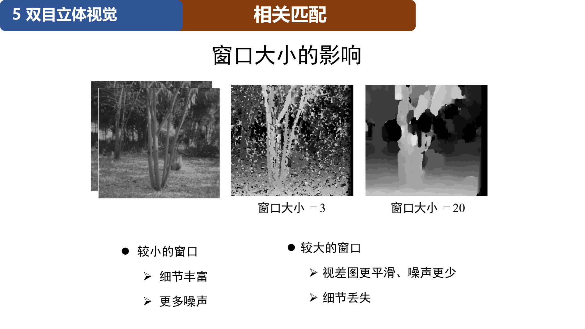

### 考试答法

`图像校正的目的是把双目图像变换为共线且行对准的平行视图，使对应点搜索从二维区域简化为一维扫描线搜索。相关法通过比较窗口相似度寻找匹配点，但在同质区域、重复纹理、遮挡、透视变化和窗口尺度选择不当时容易失败。`

---

## 25. SFM、控制运动结构、增量法求 SFM、PnP、BA

### 课件原话 / 定义

课件《运动恢复结构》p.2 写：`Structure from Motion (SFM)`，`通过三维场景的多张图象，恢复出该场景的三维结构信息以及每张图片对应的摄像机参数`。

你写的 `控制运动结构` 大概率是课堂上把 `运动恢复结构` 听混了，考试按 `SFM / Structure from Motion / 运动恢复结构` 准备。

### 原 PPT

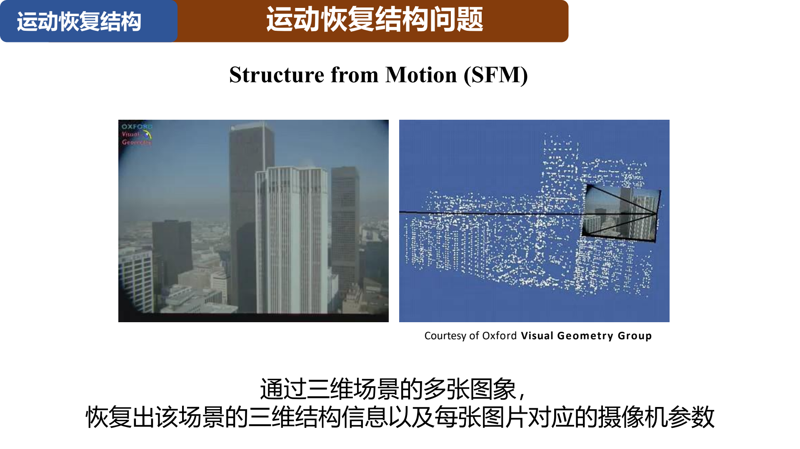


### 增量法原话

课件 p.44 写了输入输出：`输入：摄像机内参数、特征点和几何效验后的匹配结果`；`输出：三维点云、摄像机位姿`。流程包括 Tracks、连通图、估计本质矩阵 E、分解 E、三角化、PnP、Bundle Adjustment。

### PnP 和 BA 原话

课件 p.33 写：`PnP（Perspective-n-Point）问题：指通过世界中 N 个三维点坐标及其在图像中 N 个像点坐标，计算出相机或物体位姿的问题。`

课件 p.27-p31 讲 BA：`最小化重投影误差`，并说常用作 SfM 最后一步。

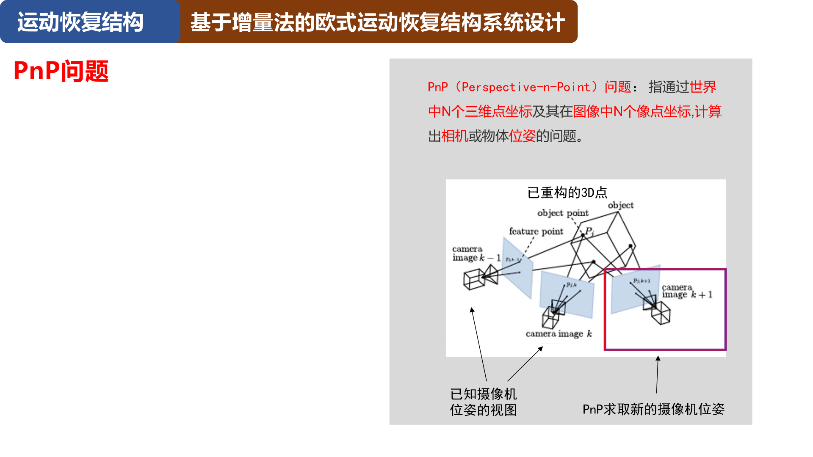

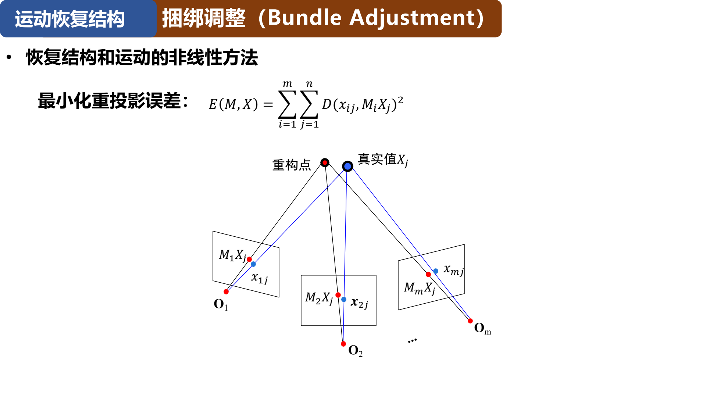

### 老师可能怎么加深考

这块我会押最高优先级。它能自然组成 20 分综合题，因为它把前面很多知识串起来：

```text
特征匹配 -> RANSAC 过滤误匹配 -> 估计 F/H 或 E -> 分解 E 得到 R,t -> 三角化初始点云 -> PnP 加入新视图 -> BA 全局优化
```

答题时不要只写“恢复三维结构”，要写输入输出：

```text
输入：摄像机内参数、特征点、几何校验后的匹配结果。
输出：三维点云、摄像机位姿。
```

如果问 PnP：它不是求三维点，而是在已知 3D 点和 2D 像点对应时求相机位姿。  
如果问 BA：它不是新增点，而是联合优化相机参数和三维点，让重投影误差最小。

### 考试答法

`SFM 是 Structure from Motion，运动恢复结构，目标是由多张图像恢复场景三维结构和每张图像对应的相机参数。增量法先由两视图估计 E、恢复位姿并三角化初始点云，再逐步加入新视图，用 PnP 估计新相机位姿，三角化新增点，最后通过 Bundle Adjustment 最小化重投影误差，联合优化相机参数和三维点。`

---

## 26. RANSAC 随机采样一致性

### 课件原话 / 定义

课件《拟合》p.20 写：`随机采样一致性（RANSAC）：在存在外点的情况下进行模型拟合的非常通用的框架`。流程包括随机选择小部分样本、拟合模型、找到接近模型的剩余点、多次执行选择最佳模型。

### 原 PPT

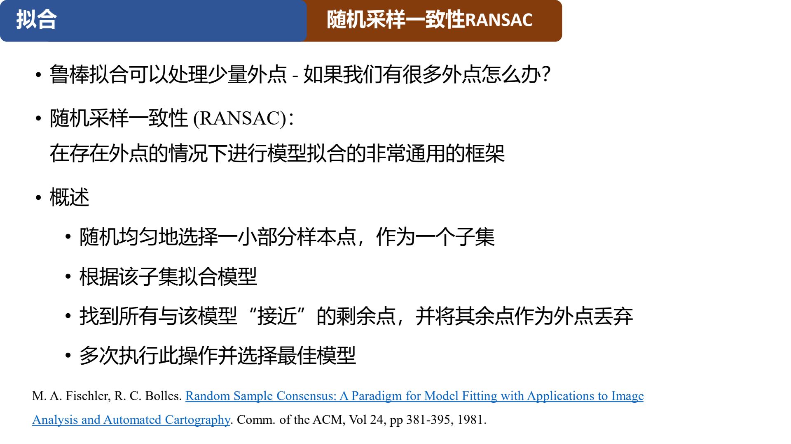

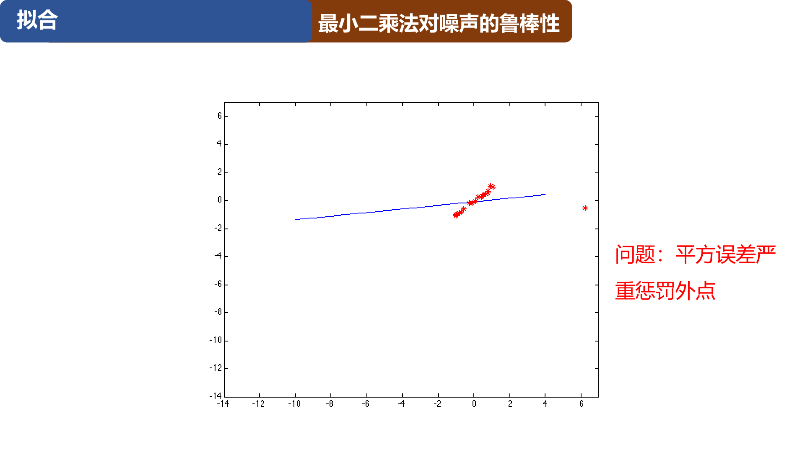

### 自绘辅助图

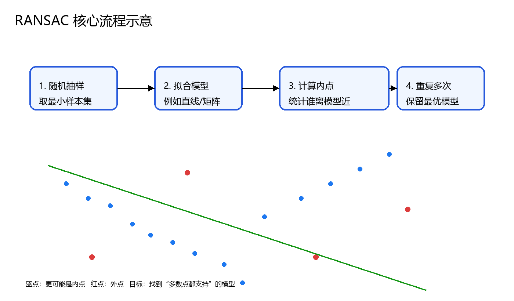

### 老师可能怎么加深考

RANSAC 常和最小二乘比较：

```text
最小二乘：所有点都参与，外点会严重拉偏结果。
RANSAC：先随机抽小样本拟合，再用内点数验证，能抵抗外点。
```

RANSAC 也常和 SFM 连用：特征匹配里会有误匹配，增量 SFM 前面要用 RANSAC 估计基础矩阵 F 或单应矩阵 H，过滤错误匹配。

### 考试答法

`RANSAC = Random Sample Consensus，随机采样一致性。它通过随机抽取最小样本集拟合模型，再统计满足误差阈值的内点数量，重复多次并选择内点最多或误差最小的模型，适合含外点数据的鲁棒拟合。`

---

## 27. 霍夫变换和极坐标平面内累加器单元算法

### 课件原话 / 定义

课件《拟合》p.45 讲 Hough 空间，p.49 对极坐标形式写出累加器算法：将 `θ∈[0,180]`、`ρ∈[0,ρmax]` 划分成小格，将每个小格的累加器 `H(ρ, θ)` 初始化为零；对每个点遍历 θ，计算 `ρ = x_i cosθ + y_i sinθ`，然后 `H(ρ, θ) = H(ρ, θ) + 1`。

### 原 PPT

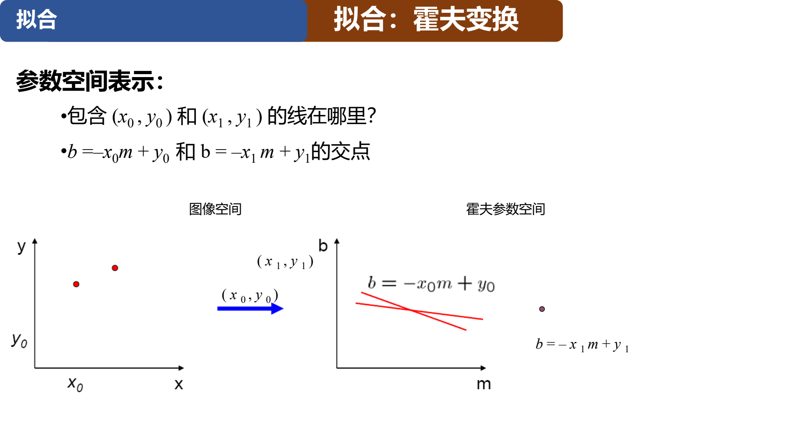


### 老师可能怎么加深考

霍夫和 RANSAC 都能找直线，但思路不同：

```text
RANSAC：随机抽样，提出模型，统计内点。
Hough：所有点投票，在参数空间找峰值。
```

如果题目写“极坐标平面内累加器单元算法”，答题必须出现四个词：`参数空间离散化`、`累加器 H(ρ,θ)`、`投票`、`峰值`。

### 考试答法

`Hough Transform 是霍夫变换，核心思想是把图像空间中的点映射到参数空间投票。极坐标累加器算法将 θ 和 ρ 的参数空间离散成网格，对每个图像点遍历 θ 并计算 ρ，在对应累加器单元加 1，最后票数峰值对应检测到的直线参数。`

---

## 28. 中英互译专题

这部分按你记录的“八个术语翻译”准备，优先背下面这些。

| English | 中文 |
|---|---|
| CVPR, Conference on Computer Vision and Pattern Recognition | 计算机视觉与模式识别会议 |
| ICCV, International Conference on Computer Vision | 国际计算机视觉会议 |
| ECCV, European Conference on Computer Vision | 欧洲计算机视觉会议 |
| photogrammetry | 摄影测量 |
| Visual illusion | 视错觉 |
| SFM, Structure from Motion | 运动恢复结构 |
| RANSAC, Random Sample Consensus | 随机采样一致性 |
| Hough Transform | 霍夫变换 |
| Essential Matrix | 本质矩阵 |
| Fundamental Matrix | 基础矩阵 |
| Homography / Homography Matrix | 单应 / 单应矩阵 |
| Bundle Adjustment | 捆绑调整 |
| Perspective-n-Point, PnP | 透视 n 点位姿估计 |
| CCD, Charge Coupled Device | 电荷耦合器件 |
| HDR, High Dynamic Range | 高动态范围 |
| Field of View, FOV | 视场 |
| Working Distance, WD | 工作距离 |
| Rayleigh Criterion | 瑞利判据 |

---

## 29. 课内出现过的题目专题分析

### 题型 1：概念识别单选

代表题：三大会议、正常视力 1′、光通量单位 lm、镜头分辨率 lp/mm、远心镜头、Bayer 阵列绿色最多、HDR 阈值。

答题策略：这种题不要写太多，直接记关键词和单位。

### 题型 2：定义解释简答

代表题：图像处理/分析/理解、视错觉原因、光通量与辐通量区别、相机标定、标定板作用、相关法问题。

答题策略：先写课件定义，再补一句白话意义，最后写用途或影响。

### 题型 3：流程题

代表题：增量法求 SFM、RANSAC、霍夫累加器算法。

答题策略：按步骤编号，不要写成一大段。流程题最怕漏关键节点，比如 SFM 里漏 PnP 和 BA，RANSAC 里漏“统计内点”。

### 题型 4：画图题

代表题：理想光学系统作图、极几何示意图、彩色 CCD/Bayer 阵列。

答题策略：符号比画得好看更重要。理想光学系统必须有 H/H'、F/F'、光轴、入射线、出射线；极几何必须有 O1/O2、P、p/p'、极线、极点、极平面。

### 题型 5：计算题

代表题：Retina 屏/1′ 空间分辨率、动态范围 dB、焦距选择、平行双目深度、运动清晰成像。

答题策略：先写公式，再代数值，最后写单位。单位错很亏。

---

## 30. 最后背诵路线

如果时间非常紧，按这个顺序背：

1. `SFM + 增量法 + PnP + BA`
2. `RANSAC + Hough + 累加器`
3. `三角化 + 极几何 + E/F/H`
4. `理想光学系统作图`
5. `1′ + 5.0 + 瑞利判据 + 视错觉 + 大猩猩`
6. `光通量/辐通量/照度/555nm`
7. `镜头/F数/焦距/远心镜头/CCD`
8. `CVPR/ICCV/ECCV/photogrammetry` 翻译

---

## 31. 高频考点精简强化版

这章只放最可能被老师拿来出大题、计算题、画图题的内容。每条按“课件锚点 + 必背公式/关键词 + 考场答法 + 易错点”背。

| 高频点 | 课件锚点 | 必背核心 | 考场答法 |
|---|---|---|---|
| 增量法 SFM | 《运动恢复结构》p.44，原图 `ppt_originals/sfm_incremental_p44.png` | `SFM = Structure from Motion`；输入内参、特征点、几何校验匹配；输出三维点云、摄像机位姿 | 先建 tracks 和连通图，选初始图像边，估计 `E` 并分解位姿，三角化初始点；之后用 `PnP` 加新相机，三角化新点，最后 `Bundle Adjustment` 优化。 |
| RANSAC | 《拟合》p.31-p.33，原图 `ppt_originals/ransac_p20.png` | `Random Sample Consensus`；随机采样、内点、阈值、迭代、最佳模型 | 随机取 `n` 点拟合模型，用阈值 `t` 判断内点；若内点数大于 `d`，用内点重估；重复 `k` 次，选误差最小/内点最多的模型。 |
| 霍夫变换 | 《拟合》p.45/p.50，原图 `ppt_originals/hough_p45.png` | `Hough Transform`；参数空间投票；`ρ=xcosθ+ysinθ` | 初始化累加器 `H(ρ,θ)`，每个图像点遍历 `θ` 算 `ρ` 并投票，累加器峰值就是直线参数。 |
| 三角化 | 《三角化与极几何》p.5，原图 `rendered_pages/计算机视觉-5 三角化与极几何_p5.png` | 由多视图二维像点和相机关系求三维点 | 两个相机中心分别连向对应像点，空间射线交会处就是三维点；有噪声时求最接近的交点。 |
| 极几何 | 《三角化与极几何》p.15，原图 `rendered_pages/计算机视觉-5 三角化与极几何_p15.png` | 基线、极平面、极线、极点 | 极平面过 `P,O1,O2`；极线是极平面与成像平面交线；极点是基线与成像平面交点；匹配点只能在对应极线上找。 |
| `E/F/H` | 《三角化与极几何》p.30/p.35，原图 `ppt_originals/fundamental_matrix_p30.png` | `x'^T F x=0`，`E=[t]xR`，`F=K'^{-T} E K^{-1}`，`p'=Hp` | `E` 用归一化相机坐标并含相对位姿；`F` 用像素坐标表达极线约束；`H` 是平面或纯旋转的点到点映射。 |
| 相机标定 | 《光学成像原理&相机标定》p.58/p.88/p.90，原图 `rendered_pages/计算机视觉-4 光学成像原理&相机标定_p90.png` | 标定就是求内外参数；`K=[[fx,s,cx],[0,fy,cy],[0,0,1]]` | 内参含 `fx/fy`、主点 `cx/cy`、像素斜切 `s`；外参是 `R,t`；标定板提供已知几何点，建立世界点到图像点的对应。 |
| 坐标转换 | 《光学成像原理&相机标定》p.58 附近 | `Xc=R Xw+t`，`x=K[R|t]Xw`，`u=fxX/Z+cx`，`v=fyY/Z+cy` | 世界坐标说明物体在哪里；相机坐标说明相机眼里在哪里；像素坐标说明图像第几列第几行。 |
| 瑞利判据与 `1′` | 《2.3 人眼视觉特性》p.4/p.10/p.20，原图 `ppt_originals/vision_quiz_p20.png` | 瑞利：`θ=1.22λ/D`；正常视力：`1′=π/(180×60)` rad | 给 `λ,D` 用瑞利公式；给观看距离 `L` 和 `1′` 用 `s≈Lθ`。注意 `1′` 是角分，不是时间分钟。 |
| 光度学 | 《2.4 光度学与色度学》p.8-p.30，原图 `ppt_originals/light_flux_quiz_p30.png` | 辐通量 `W`；光通量 `lm`；照度 `lx`；`1 lx=1 lm/m^2` | 辐通量看物理能量；光通量加入人眼视觉敏感度；照度是单位面积接收的光通量。 |
| HDR / 动态范围 | 《2.3 人眼视觉特性》p.63/p.66 | 动态范围是最大亮度与最小亮度范围；课件写大于 `4` 个量级/`80dB` 称 HDR | 计算题先求比值，再转 dB；判断题记住 `80dB` 这个阈值。 |
| F 数和光圈 | 《视觉系统构成》p.42，原图 `rendered_pages/计算机视觉-3 视觉系统构成_p42.png` | `F=f/D`；F 数越小，孔径越大，进光越多 | 进光量近似与 `1/F^2` 成正比；从 `F2.8` 到 `F4` 是进光减少，不是增加。 |
| 焦距选择 | 《视觉系统构成》p.49/p.50，原图 `rendered_pages/计算机视觉-3 视觉系统构成_p49.png` | 焦距越长，成像越大，视场越小 | 先求放大率，再求焦距，最后选最接近的标准镜头，如 `8mm、12.5mm、16mm、25mm、50mm`。 |
| 双目深度 | 《双目立体视觉》p.20/p.30 | `z=Bf/d` | `B` 是基线，`f` 是焦距，`d` 是视差；若 `d` 用像素，`f` 也要用像素。视差越大，物体越近。 |
| 运动清晰成像 | 《视觉系统构成》p.63/p.66，原图 `rendered_pages/计算机视觉-3 视觉系统构成_p63.png` | `像移=物体速度×曝光时间×成像倍率` | 要求 `像移≤像元尺寸/允许拖影`，可推出 `t≤像元尺寸/(速度×倍率)`。单位先统一成 mm、s。 |
| 理想光学系统作图 | 《光学成像原理&相机标定》p.50，原图 `ppt_originals/ideal_optics_quiz_p50.png` | 光轴、`H/H'`、`F/F'`、两条关键光线 | 画图先标主平面和焦点；平行光出射过 `F'`，过 `F` 入射出射平行光轴；交点为像点。 |
| 彩色 CCD | 《视觉系统构成》p.90，原图 `ppt_originals/color_ccd_p90.png` | 滤色片、Bayer 阵列、插值恢复 RGB | 彩色 CCD 不是每个像素直接测完整 RGB，而是先按滤色阵列采样，再经插值/去马赛克得到彩色图。 |
| 相关法问题 | 《双目立体视觉》p.40，原图 `ppt_originals/stereo_problem_p40.png` | 同质区域、重复纹理、遮挡、窗口大小 | 同质区域没特征；重复纹理会多解；遮挡点无对应；窗口太小抗噪差，太大又会跨越深度边界。 |

### 31.1 三个最容易混的公式

```text
瑞利判据：θ = 1.22λ / D
正常视力线距离：s ≈ L × π / (180×60)
双目深度：z = Bf / d
```

区分方法：题目给 `λ` 和孔径/瞳孔直径 `D`，用瑞利；题目给观察距离和 `1′`，用正常视力线距离；题目给双目基线、焦距、视差，用双目深度。

### 31.2 简答题万能压缩模板

```text
定义：先写课件定义或英文全称。
作用：说明它解决什么问题。
流程/公式：写 3-5 个关键词步骤或核心公式。
易错点：补一句和相近概念的区别。
```

例如 SFM：定义是从运动恢复结构；作用是从多张图恢复三维点云和相机位姿；流程是特征匹配、估计 E、分解位姿、三角化、PnP 加新图、BA 优化；易错点是不要漏 `PnP` 和 `Bundle Adjustment`。
