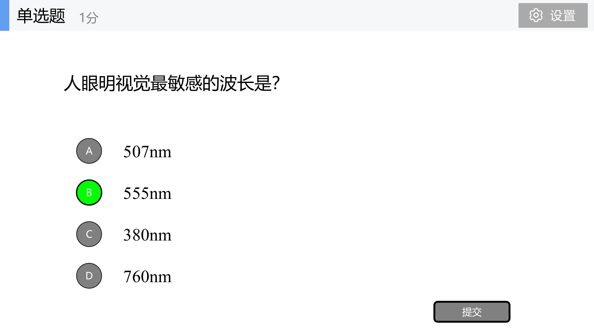
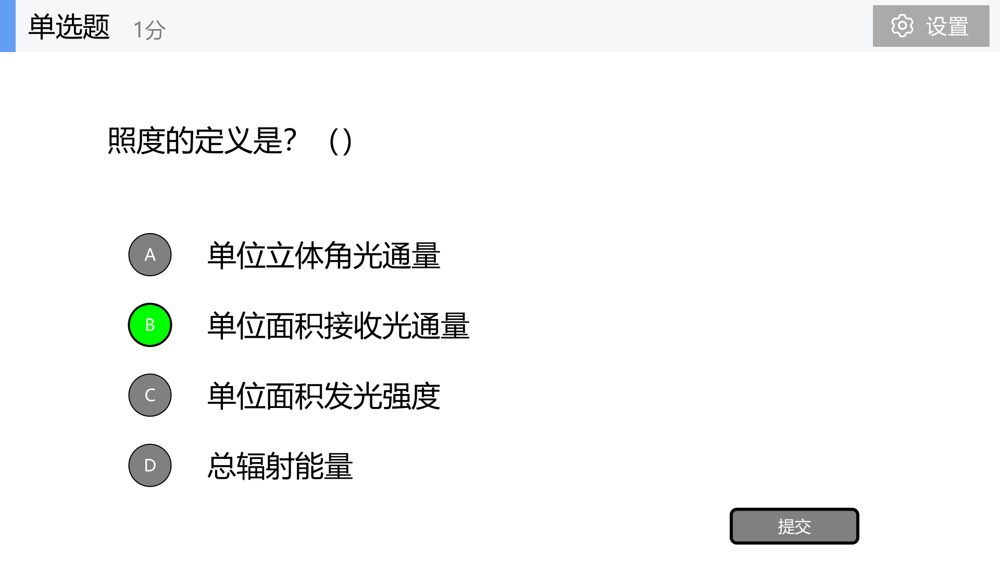
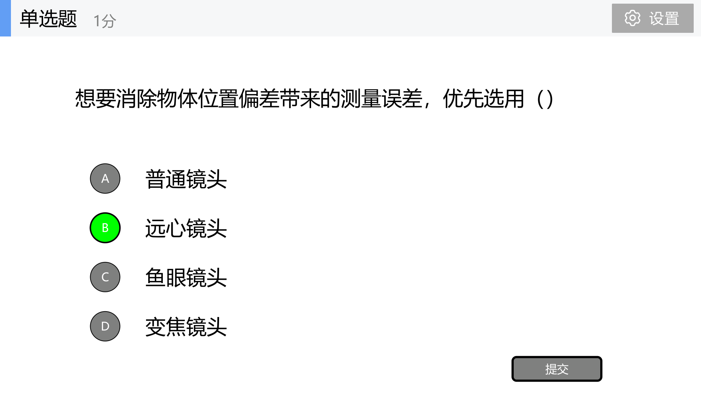

# 课内出现过的题目专题分析

这份只整理课件里已经出现过“题目痕迹”的内容。复习时可以把它当成老师出题风格样本：先看原题，再看它背后的知识点和可能变体。

## 1. 顶会识别题：CVPR / ICCV / ECCV

### 原课件题目

《计算机视觉-1计算机视觉应用概述》p.26：`下列哪项是计算机视觉三大顶级会议之一，且每两年举办一次（偶数年举行）？`


### 考点

这题表面考会议，实际考中英术语和课件原表格。p.24 已经写出三大顶会：`CVPR`、`ICCV`、`ECCV`。

### 答案和解析

答案是 `ECCV`。因为课件写 ECCV 是欧洲计算机视觉会议，并标注为偶数年举行。考试可能改成填空：`CVPR` 全称、`ICCV` 中文、`ECCV` 是否属于三大顶会。

---

## 2. 人眼空间分辨率：1′、正常视力、Retina 屏

### 原课件题目

《2.3 人眼视觉特性》p.20：`正常视力标准规定，能分辨多大视角的视力为正常视力（记为 5.0）？`


《2.3 人眼视觉特性》p.14：Retina 屏计算题，用 `25cm` 观看距离和 `1′` 视角估算像素间距或 ppi。


### 考点

课件核心原话是：正常视力能分辨 `1′` 视角，记为 `5.0`。空间分辨率本质是分辨相邻两个点的能力。

### 答案和解析

正常视力题答案是 `1′`。计算题用小角度近似：

```text
s ≈ L * θ
1′ ≈ 2.91e-4 rad
```

如果 `L=25cm`，最小可分辨距离约 `0.0728mm`。老师可能变题为：给 `5m` 距离，求最小可分辨间距。

---

## 3. 瑞利判据

### 原课件题目

《2.3 人眼视觉特性》p.17：评价人眼空间分辨率的重要依据，用于判断是否能恰可分辨两个物点。


### 考点

课件 p.5 原话：`点物 S1 的艾里斑中心恰好与另一个点物 S2 的艾里斑边缘相重合时，恰可分辨两物点`。

### 答案和解析

答案是 `瑞利判据`。它经常和空间分辨率、最小分辨角联系起来。遇到“恰可分辨”“两个点目标”“艾里斑”这些词，基本就是瑞利判据。

---

## 4. 视觉暂留和眨眼时间

### 原课件题目

《2.3 人眼视觉特性》p.26：视觉暂留现象影像在视网膜上保留时间约为多少。


### 考点

课件写视觉暂留约 `0.1~0.4 秒`。另在《2.1&2.2》p.67 写平均每次眨眼约 `0.3~0.4 秒`。


### 答案和解析

视觉暂留题答 `0.1~0.4 秒`。这类题通常是填空/单选，优先记数值和概念：视觉刺激消失后，视觉印象仍短暂停留。

---

## 5. 视错觉和注意盲视

### 原课件题目

《2.3 人眼视觉特性》p.46：`视错觉产生的本质原因是？`


《2.3 人眼视觉特性》p.50：看不见的大猩猩实验。


### 考点

视错觉考 `visual illusion` 翻译，也考原因。大猩猩实验考选择性注意和注意盲视。

### 答案和解析

答题模板：`视错觉是视觉系统在背景、对比、经验和神经加工影响下产生的错误知觉；看不见的大猩猩说明视觉注意具有选择性，看见不等于注意到。`

---

## 6. HDR 和动态范围计算

### 原课件题目

《2.3 人眼视觉特性》p.67：国际上通常将动态范围大于多少量级或 dB 的图像称为 HDR 图像。


《2.3 人眼视觉特性》p.68：给最大亮度和最小亮度，求动态范围 dB。


### 考点

课件定义：最大亮度值与最小亮度值之间的范围称为相机成像的动态范围。HDR 阈值是大于 `4 个量级（80dB）`。

### 答案和解析

动态范围公式：

```text
DR(dB) = 20 log10(最大亮度 / 最小亮度)
```

如果比值是 `10^9`，则 `DR = 180dB`。注意不要漏 `20log`，也不要忘单位 dB。

---

## 7. 光度学：555nm、光通量、辐通量、照度

### 原课件题目

《2.4 光度学与色度学》p.29：人眼明视觉最敏感波长。



p.30：光通量单位。


p.31：照度定义。



### 考点

课件定义：`辐通量` 是单位时间内通过某截面的所有波长总电磁辐射能量，单位 `W`；`光通量` 是可见光对人眼视觉刺激程度的量，单位 `lm`；`照度` 是单位面积上的光通量，单位 `lx`。

### 答案和解析

必背：

```text
555nm：明视觉最敏感波长
光通量：lm
辐通量：W
照度：lx = lm/m^2
```

比较题答法：`辐通量偏物理能量，光通量考虑人眼视觉敏感性，照度是单位面积接收的光通量。`

---

## 8. 颜色匹配实验和三刺激值

### 原课件题目

《2.4 光度学与色度学》p.62：颜色匹配实验中三刺激值的核心定义。


### 考点

三刺激值的核心是：与待测色达到色匹配时所需要的三原色数量。

### 答案和解析

答题模板：`颜色匹配实验通过调节三原色刺激值，使混合光与待测颜色在视觉上相同。三刺激值表示匹配待测颜色所需三原色的数量，是 CIE 色度系统的基础。`

---

## 9. 光源选择和成像影响因素

### 原课件题目

《视觉系统构成》p.27-p31 连续出现照明题：照明目的、背光、暗场、偏振、环形光源。


### 考点

照明的目标是显现重要特征、抑制不需要的特征。光源影响因素包括光强、光谱、方向、扩散、偏振，以及物体反射/透射/散射性质。

### 答案和解析

背光看轮廓，暗场看划痕和凹凸，偏振减反光，环形光用于通用外观检测。题目很可能是单选，也可能让简述光源如何影响视觉成像。

---

## 10. 镜头参数：WD、焦距、分辨率、F 数、远心镜头

### 原课件题目

《视觉系统构成》p.58：工作距离定义。p.59：焦距越长，物体在传感器上的像越大。p.60：镜头分辨率单位。p.61：高精度测量优先选远心镜头。




### 考点

课件原话：镜头分辨率是镜头再现物体细部的能力；F 数定义为焦距与有效孔径直径的比值，`F=f/D`。

### 答案和解析

必背：

```text
WD：镜头前端到被测物清晰成像表面的距离
焦距越长：成像越大，视场越小
镜头分辨率单位：lp/mm
F 数：F=f/D
远心镜头：减小透视误差，适合尺寸测量
```

---

## 11. 焦距选择计算

### 原课件题目

《视觉系统构成》p.63：已知物体高度 `60mm`、像高 `6.6mm`、工作距离 `WD=200mm`，求放大倍率和焦距。


### 考点

先算放大倍率，再按牛顿公式选择焦距。

### 答案和解析

```text
β = 6.6 / 60 = 0.11
f = WD * β / (1 + β)
f = 200 * 0.11 / 1.11 ≈ 19.82mm
```

可能变体：换物体尺寸、像面尺寸、工作距离，让你重算。

---

## 12. CCD、彩色 CCD、Bayer 阵列、运动清晰成像

### 原课件题目

p.100：彩色 CCD 的 Bayer 滤波阵列中，2x2 单元里数量最多的是 `G`。p.99：无拖影清晰成像核心原则是曝光时间内像移不超过 1 个像素。


### 考点

CCD = `Charge Coupled Device`，电荷耦合器件。彩色 CCD 通过滤色片分色，Bayer 阵列常见 `2G + 1R + 1B`。

### 答案和解析

如果考画图，画：

```text
G R
B G
```

并标注：`微型镜头 -> 分色滤色片 -> 感光层`。运动清晰成像答：曝光时间内像移要小于等于 1 个像素。

---

## 13. 理想光学系统作图

### 原课件题目

《光学成像原理&相机标定》p.50：`请画出理想光学系统的简化图，并利用图解法，画出平行于光轴的出射光线。`


### 考点

画图题几乎就是它。必须画：光轴、主面 `H/H'`、焦点 `F/F'`、平行入射线、过像方焦点 `F'` 的出射线。

### 答案和解析


答题句：`平行于光轴的入射光线经过理想光学系统后，出射光线通过像方焦点 F'。`

---

## 14. 相机内参数、相机标定和标定板

### 原课件题目

《光学成像原理&相机标定》p.78：小孔成像模型中，摄像机内参数不包括哪一项，答案是 `旋转矩阵 R`。p.79：高精度测量应选复杂非线性模型。p.90：相机标定目标是计算内外参数。


### 考点

内参描述相机内部成像，外参描述相机在世界中的姿态位置。标定板提供结构已知、精度较高的空间参考点，用来建立世界点与图像点对应。

### 答案和解析

答题模板：`相机标定是求解成像模型中的内参数和外参数，有时还包括畸变参数。标定板提供已知几何结构，使真实空间点与图像点建立对应关系。R 和 t 是外参数，不属于内参数。`

---

## 15. 三角化、极点极线极平面、E/F/H

### 原课件题目

《三角化与极几何》p.5：三角化定义。p.15：极平面、极线、极点定义。p.30 和 p.35：基础矩阵与秩约束。


### 考点

这块很可能出简答或综合题：

```text
三角化：由多视图二维点和相机关系求三维点
极平面：P、O1、O2 构成的平面
极线：极平面与图像平面的交线
极点：基线与图像平面的交点
E：归一化相机坐标下的极几何
F：像素坐标下的极几何，秩为 2
H：平面到平面的单应映射
```

### 答案和解析

如果问 E/F/H 区别：`E 用于规范化相机坐标，F 用于像素坐标下的两视图极几何，H 用于同一平面上的图像映射。基础矩阵理论上秩为 2，实际估计后可用 SVD 强制秩约束。`

---

## 16. 平行双目、图像校正、相关法问题

### 原课件题目

《双目立体视觉》p.20：平行双目视差公式。p.30：图像校正。p.40：相关法窗口影响。


### 考点

平行双目公式：

```text
z = Bf / d
```

图像校正的目标是让两幅图像共线且行对准。相关法问题包括同质区域、重复纹理、遮挡、透视变化、窗口大小矛盾。

### 答案和解析

答题模板：`图像校正把双目图像变成近似平行视图，使对应点搜索从二维区域简化为一维扫描线搜索。相关法通过窗口相似度匹配，但在同质区域、重复纹理、遮挡和光照变化下容易失败。`

---

## 17. SFM、增量法、PnP、Bundle Adjustment

### 原课件题目

《运动恢复结构》p.2：`Structure from Motion (SFM)`，通过多张图像恢复场景三维结构和每张图片对应的摄像机参数。p.44：增量法求解 SFM 完整流程。


### 考点

这块我判断最可能考综合题。课件流程关键词：

```text
输入：摄像机内参数、特征点和几何校验后的匹配结果
输出：三维点云、摄像机位姿
Tracks -> 连通图 -> 选边 -> 估计 E -> 分解 E -> 三角化 -> PnP -> BA
```

### 答案和解析

答题模板：`SFM 是 Structure from Motion，运动恢复结构，目标是从多张图像恢复三维结构和相机参数。增量法先用两视图估计本质矩阵并恢复位姿，三角化得到初始点云，再逐步加入新视图，用 PnP 求新相机位姿，三角化新增点，最后用 Bundle Adjustment 最小化重投影误差。`

注意区分：`PnP` 是用已知 3D 点和 2D 像点求相机位姿；`BA` 是联合优化相机参数和三维点。

---

## 18. RANSAC

### 原课件题目

《拟合》p.20：RANSAC 是在存在外点情况下进行模型拟合的通用框架。p.15：平方误差严重惩罚外点，说明最小二乘容易被外点带偏。


### 考点

RANSAC = `Random Sample Consensus`，随机采样一致性。流程：

```text
随机抽取最小样本集
拟合模型
计算所有点误差
统计内点
重复多次，选最好模型
```

### 答案和解析

RANSAC 和最小二乘区别：`最小二乘默认所有点都可信，外点会拉偏模型；RANSAC 通过随机抽样和内点统计寻找由多数好点支持的模型，抗外点能力强。`

---

## 19. 霍夫变换和极坐标累加器

### 原课件题目

《拟合》p.45：Hough 参数空间。p.49：极坐标平面内累加器单元算法。


### 考点

Hough Transform = 霍夫变换。核心是把图像空间点映射到参数空间投票。极坐标形式：

```text
x cosθ + y sinθ = ρ
```

累加器算法必须写出：参数空间离散化、累加器 `H(ρ,θ)`、遍历点和角度、投票、找峰值。

### 答案和解析

Hough 和 RANSAC 区别：`RANSAC 是随机抽样提出模型，再统计内点；Hough 是让所有点在参数空间投票，峰值对应目标参数。`

---

## 20. 中英互译候选池

| English | 中文 |
|---|---|
| CVPR, Conference on Computer Vision and Pattern Recognition | 计算机视觉与模式识别会议 |
| ICCV, International Conference on Computer Vision | 国际计算机视觉会议 |
| ECCV, European Conference on Computer Vision | 欧洲计算机视觉会议 |
| photogrammetry | 摄影测量 |
| Visual illusion | 视错觉 |
| SFM, Structure from Motion | 运动恢复结构 |
| RANSAC, Random Sample Consensus | 随机采样一致性 |
| Hough Transform | 霍夫变换 |
| Essential Matrix | 本质矩阵 |
| Fundamental Matrix | 基础矩阵 |
| Homography / Homography Matrix | 单应 / 单应矩阵 |
| Bundle Adjustment | 捆绑调整 |
| Perspective-n-Point, PnP | 透视 n 点位姿估计 |
| CCD, Charge Coupled Device | 电荷耦合器件 |
| HDR, High Dynamic Range | 高动态范围 |
| Field of View, FOV | 视场 |
| Working Distance, WD | 工作距离 |
| Rayleigh Criterion | 瑞利判据 |
